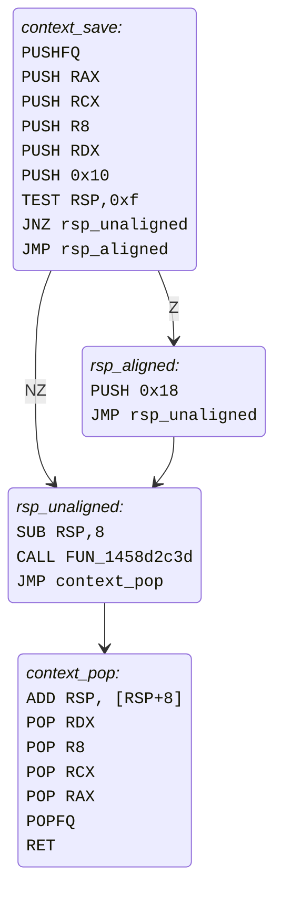

# Reversing Arxan (now GuardIT)
This article focuses on the reverse engineering and declawing of the Arxan anti-debug and tamper protection software as it is used in FROMSOFTWARE games. It assumes basic x86 assembly, low-level reverse engineering, C and Rust knowledge.

## Introduction
If you've ever tried to attach a debugger to a FROMSOFTWARE game, you probably experienced random crashes. Likewise, modders that need to hook or patch native game code have likely experienced crashes and/or their patches being reverted by the game after a random amount of time.

The source of these problems is an anti-debug and tamper protection product now called GuardIT. However, it is better known in the community by its older name, Arxan, which I will use to refer to it throughout this article. FROMSOFTWARE has applied it to all of their PC releases since Dark Souls II: SOTFS, excluding Sekiro. Some of its features include:

- Instruction mutations and control flow obfuscation to confuse decompilers and make reverse engineering harder
- Encryption of sensitive functions at rest, decrypting them ephemerally when they are being executed
- A varied suite of anti-debug checks
- Integrity checks on functions marked as sensitive by the game developer, with the ability to a combination of the following when tampering is detected:
    - Silently writing flags to a buffer that the game developer can read to integrate with their anti-cheat solution. FROMSOFTWARE uses this to ban players that try to tamper with the game's code while playing online.
    - Crashing the game by corrupting the stack or control flow in a way that is difficult to debug
    - Repairing the function's code

<!-- markdown-link-check-disable -->

Running into these protections when reverse engineering the game or when modding it can be a serious hassle. In fact, Dark Souls III support in me3 was, for a long time, blocked by the need to hook a function whose code integrity is checked by Arxan. As such, a way to fully disable it and ensure that no Arxan logic is running would be highly desirable. This blog will cover my journey through reversing how Arxan inserts its code into executables, how it protects itself from tampering attempts and how its function encryption mechanism works, culminating in the release of [dearxan](https://crates.io/crates/dearxan), a Rust crate that is able to neuter it at runtime in all FROMSOFTWARE games.

<!-- markdown-link-check-enable -->

Since 0.8.0, **me^3^** now ships with `dearxan`, allowing you to use the `disable_arxan` flag in your mod profile or from the CLI.

## Prior Art
There has been a few attempts to counter Arxan's protections by the Souls modding and cheating community. Most focus on a specific feature, such as code integrity checks, code restoration or anti-debug, support a limited set of games, or require manually finding offsets to problematic Arxan code (which has to be done for every supported game version).

#### DS3 and DSR "anti cheat bypasses"
Dark Souls III and Dark Souls Remastered had a very active online cheating community. Many cheats required hooking game functions that are protected by Arxan. Detection of this tampering while playing online would lead to bans, so some have taken a crack at semi-manually patching out most of the integrity checks. The resulting "bypasses" were kept private and distributed among small groups of cheaters before inevitably getting leaked to more and more people. They were also used by early community anti cheats such as the [DS3 PvP Watchdog](https://www.nexusmods.com/darksouls3/mods/352).

#### [MetalCrow](https://github.com/metal-crow)'s DS1 Overhaul anti-anti cheat
The [Dark Souls 1 Overhaul](https://github.com/metal-crow/Dark-Souls-1-Overhaul) mod is meant to dramatically improve the online PvP experience in Dark Souls Remastered. To prevent users being banned due to the code patches made by the mod, code integrity checks where manually found so they can be patched out ([source](https://github.com/metal-crow/Dark-Souls-1-Overhaul/blob/master/OverhaulDLL/src/AntiAntiCheat.cpp)). 

#### Yui's anti code restoration patches
[Yui](https://github.com/LukeYui)'s [Seamless Co-op](https://www.nexusmods.com/eldenring/mods/510) mods require hundreds of hooks to function, many of which target code that is protected by Arxan's anti-tamper code restoration feature. She found that since Elden Ring, these routines are (almost?) all triggered from timed checks in regular game code, most likely for performance reasons. The code determining if it's time to run an individual check looks like this:

<a name="timed_restoration_check"></a>
```c linenums="1"
if (TIME_LEFT == 0.0f) {
    TIME_LEFT = get_random_delay_seconds(CHECK_FLAG);
}
else {
    TIME_LEFT -= 0.016666f; // one 60FPS frame
    if (TIME_LEFT <= 0.0f) {
        arxan_code_restoration_check();
    }
}
```

Or, in assembly:
```nasm linenums="1" hl_lines="14"
MOVSS      XMM0,dword ptr [TIME_LEFT]
UCOMISS    XMM0,XMM6
JP         no_timer_reset
JNZ        no_timer_reset
MOV        ECX,0x10cd ; CHECK_FLAG
CALL       get_random_delay_seconds
MOVSS      dword ptr [TIME_LEFT],XMM0
JMP        check_end

no_timer_reset:
ADDSS      XMM0,dword ptr [NEGATIVE_ONE_OVER_SIXTY] 
MOVSS      dword ptr [TIME_LEFT],XMM0
COMISS     XMM6,XMM0
JC         check_end
LEA        RDX,[TIME_LEFT]
MOV        RCX,RBX
CALL       arxan_code_restoration_check

check_end:
```

It happens to be very easy to scan for this instruction pattern and replace the final `JC` above with an unconditional jump to skip the check ([example implementation](https://github.com/tremwil/param_field_mapper/blob/master/src/arxan_disabler.cpp)).

Given its simplicity and ease of implementation, I would still recommend this technique if your mod targets Elden Ring or more recent FROMSOFTWARE games and all you need is to make sure your hooks aren't tampered with.

#### Dasaav's [ProDebug](https://github.com/Dasaav-dsv/ProDebug)
This DLL mod by [Dasaav](https://github.com/Dasaav-dsv) uses pattern scanning to identify timers in the game code that trigger some of Arxan's anti debug checks. In Elden Ring and Armored Core VI, this seems to be the only place from which the anti-debug routines run, making the technique sufficient to disable (almost?) all anti-debug features.

#### Maurice Heumann's BO3 reversing work
[This excellent blog post](https://momo5502.com/posts/2022-11-17-reverse-engineering-integrity-checks-in-black-ops-3/) by [Maurice Heumann](https://github.com/momo5502/) showcases patching out Arxan integrity checks in Call of Duty: Black Ops III. Since I was not aware of this before having come up with my own technique for disabling Arxan, I did not investigate his method and whether it works in FROMSOFTWARE titles. Note that it only addresses the integrity checks, and not the anti-debug routines or runtime function encryption.

## Motivation
I began this project a few months ago at the request of [Yui](https://github.com/LukeYui), when she was working on porting her [Seamless Co-op](https://www.nexusmods.com/eldenring/mods/510) mod to Dark Souls Remastered. The technique [outlined above](#yuis-anti-code-restoration-patches) for preventing Arxan to restore modified code regions does not work in DSR, as the code restoration checks are inserted in random functions as opposed to being put into dedicated timer routines. Furthermore, many code integrity checks immediately crash the game, so patching the restoration step out would not be sufficient.

Thus, the mod was blocked on being able to disable Arxan code integrity checks in general. I knew of [MetalCrow's prior work](#metalcrows-ds1-overhaul-anti-anti-cheat) on this, but did not want to rely on a hardcoded list of check addresses. I thus started from scratch by inspecting the structure of the code restoration routines that the Elden Ring specific pattern could find.

## The Arxan Stub

It turns out that Arxan inserts its code in the original binary in a way that is reminiscent to that of runtime instrumentation tools. I've dubbed these individual insertion points "Arxan stubs".

### General Structure

Looking at `arxan_code_restoration_check` in one of [the timer-based code restoration check pattern](#timed_restoration_check) matches, we see the following (ER 1.16.0 @ `145c62312`):

```nasm linenums="1" hl_lines="3 7 13 15 17"
MOV     qword ptr [RSP + -0x8],RBX
LEA     RSP,[RSP + -0x8]
LEA     RBX,[LAB_14040e11c] ; (1)
MOV     qword ptr [RSP + -0x8],RAX
LEA     RSP,[RSP + -0x8]
MOV     RAX,qword ptr [RSP + 0x8]
MOV     qword ptr [RSP + 0x8],RBX=>LAB_14040e11c ; (2)
PUSH    RAX
POP     RBX
MOV     RAX,qword ptr [RSP]
LEA     RSP,[RSP + 0x8]
PUSH    R12
LEA     R12,[LAB_1459bfddb] ; (3)
PUSH    qword ptr [RSP]
MOV     qword ptr [RSP + 0x8],R12=>LAB_1459bfddb ; (4)
POP     R12
RET     =>LAB_1459bfddb ; (5)
```

1. Return address `14040e11c` is loaded into `RBX`.
2. Return address is written to `INIT_RSP - 8`.
3. Call address `1459bfddb` is loaded into `R12`.
4. Call address is temporarily pushed to the stack.
5. Call address is popped from the stack and jumped to.

This is heavily obfuscated using Arxan's instruction substitution based obfuscation engine. However, by keeping track of the stack pointer and the two referenced addresses (lines 3 and 13) and their uses, we can see that we end up writing `LAB_14040e11c` to `RSP-8` and jumping to `LAB_1459bfddb`. In fact, going through the operations symbolically we can drastically simplify the code:

```nasm
MOV     [RSP-0x08], LAB_14040e11c
MOV     [RSP-0x10], R12
MOV     [RSP-0x18], R12
LEA     RSP, [RSP - 8]
JMP     LAB_1459bfddb
```

Ignoring the `R12` stack clobbers, note that we're pushing an address on the stack and jumping. This is essentially what a call instruction does! In fact, all of these instructions are effectively obfuscation for

```nasm
CALL    LAB_1459bfddb
JMP     LAB_14040e11c
```

This general pattern (move the return and call address to the stack, then jump using a `RET`) turns out to be great for identifying Arxan obfuscated calls.

The return address, `LAB_14040e11c`, points to a seemingly random instruction which turns out to be in the middle of a function related to [Havok](https://en.wikipedia.org/wiki/Havok_(software)) script execution. Jumping here is not valid and would certainly crash the program in a hard-to-debug way.

Looking at the call address, `LAB_1459bfddb`, we find another obfuscated call: 

```nasm linenums="1" hl_lines="3 6"
LEA     RSP,[RSP + -0x8]
MOV     qword ptr [RSP],R14
LEA     R14,[LAB_141f3e1b3] ; (1)
XCHG    qword ptr [RSP],R14
PUSH    R9
LEA     R9,[LAB_144ff7fde] ; (2)
PUSH    RAX
MOV     RAX,qword ptr [RSP + 0x8]
MOV     qword ptr [RSP + 0x8],R9=>LAB_144ff7fde
MOV     R9,RAX
POP     RAX
RET     =>LAB_144ff7fde
```

1. Return address
2. Call address

Again, the return address (`141f3e1b3`, line 3) points to a random instruction in the STL code for `std::error_category::equivalent`. The call address points to a third obfuscated call:

```nasm linenums="1" hl_lines="3 9"
LEA     RSP,[RSP + -0x8]
MOV     qword ptr [RSP],R11
LEA     R11,[LAB_145c97b12] ; (1)
PUSH    qword ptr [RSP]
MOV     qword ptr [RSP + 0x8],R11=>LAB_145c97b12
LEA     RSP,[RSP + 0x8]
MOV     R11,qword ptr [RSP + -0x8]
PUSH    R11
LEA     R11,[LAB_14515620d] ; (2)
PUSH    qword ptr [RSP]
MOV     qword ptr [RSP + 0x8],R11=>LAB_14515620d
POP     R11
RET     =>LAB_14515620d
```

1. Return address
2. Call address

The return address for this one, `145c97b12` (line 3), was more difficult to identify, as the code it points to is extremely obfuscated. However, upon a closer look it again seems to be in the middle of a regular game function. The call address, `14515620d` (line 9), however, now points to something more interesting:

```nasm hl_lines="11 14 16 23-26 32"
PUSHFQ
LEA     RSP,[RSP + -0x8]
MOV     qword ptr [RSP],RAX
MOV     qword ptr [RSP + -0x8],RCX
LEA     RSP,[RSP + -0x8]
MOV     qword ptr [RSP + -0x8],R8
LEA     RSP,[RSP + -0x8]
MOV     qword ptr [RSP + -0x8],RDX
LEA     RSP,[RSP + -0x8]
PUSH    0x10
TEST    RSP,0xf ; (1)
LEA     RSP,[RSP + -0x8]
MOV     qword ptr [RSP],RSI
MOV     RSI,LAB_1404e6f39 ; (2)
PUSH    qword ptr [RSP]
MOV     qword ptr [RSP + 0x8],RSI=>LAB_1404e6f39 ; (3)
LEA     RSP,[RSP + 0x8]
MOV     RSI,qword ptr [RSP + -0x8]
MOV     qword ptr [RSP + -0x8],RBX
LEA     RSP,[RSP + -0x8]
LEA     RSP,[RSP + -0x8]
MOV     qword ptr [RSP],RAX
MOV     RBX,qword ptr [RSP + 0x10] => LAB_1404e6f39 ; (4)
MOV     RAX,LAB_140bd28e4 ; (5)
CMOVNZ  RBX,RAX ; (6)
MOV     qword ptr [RSP + 0x10],RBX ; (7)
MOV     RAX,qword ptr [RSP]
LEA     RSP,[RSP + 0x8]
MOV     RBX,qword ptr [RSP]
LEA     RSP,[RSP + 0x8]
LEA     RSP,[RSP + 0x8]
JMP     qword ptr [RSP + -0x8] ; (8)
```

1. Sets the `Z` (zero) flag if `RSP` is a multiple of 16.
2. Loads the "zero" path (`1404e6f39`) into `RSI`.
3. Moves the zero path onto the stack.
4. Loads the zero path from the stack into `RBX`.
5. Loads the "nonzero" path (`140bd28e4`) into `RAX`.
6. Moves the nonzero path (currently `RAX`) into `RBX` (current the zero path) if the `Z` flag is not set, i.e. if `RSP` is not a multiple of 16. `RBX` is now the conditional branch address.
7. Moves the conditional branch address (currently `RBX`) onto the stack.
8. Jumps to the conditional branch address that was written to the stack.

This block is heavily obfuscated, but again, we can painstakingly go through the instructions to see that it's mostly an obfuscated conditional jump:

```nasm
PUSHFQ
PUSH    RAX
PUSH    RCX
PUSH    R8
PUSH    RDX
PUSH    0x10
TEST    RSP,0xf
JNZ     LAB_140bd28e4
JMP     LAB_1404e6f39
```

The first part of this looks very much like a partial context save. Inspecting the branches further and deobfuscating leaves us with the following graph, confirming this suspicion:

<a name="stub_cfg"></a>



Tracking the stack carefully, we can see that the `PUSH 0x10` and `PUSH 0x18` instructions serve to restore the original alignment of the stack through the `ADD RSP, [RSP+8]` instruction in `context_pop`. While I've never seen this stack alignment technique before (usually it's done branchlessly by saving `RSP` in a temporary register and clearing its lowest 4 bits), this is a very common pattern for instrumentation: save the existing CPU state on the stack, call the instrumentation routine (in this case, the call to `FUN_1458d2c3d` which presumably handles the code restoration logic), and restore the original state.

However, there is a problem here: because of the first three obfuscated calls with bogus return addresses, the final `RET` will redirect execution to the middle of an unrelated function and inevitably crash the game. Thus, I guessed that there must be something in `FUN_1458d2c3d` that writes over these "fake" return addresses. I tried to manually follow the logic of this function, but the obfuscation successfully prevented Ghidra and IDA decompilers / CFG viewers from working, and proved too annoying to go through manually. 

### Identification
Instead of immediately coming up with a better analysis workflow or deobfuscation strategy, I wondered if I could find simpler "Arxan stubs". From the above CFG, it seemed plausible that this was *the* way Arxan inserted logic into existing game code, so I started pattern scanning.

This is where Arxan's use of the `TEST RSP, 0xf` instruction comes back to haunt them. As I've said before, it's a very unusual way to align the stack, and I can't think of any other scenarios where such an instruction would be emitted. Sure enough, a search for the bytes `48 f7 c4 0f 00 00 00` gives 1598 matches. Going through a few dozen, they all follow the same context save/restore pattern! With more examples, it becomes evident that Arxan developers did try to make it harder to find these stubs:

- The order in which registers are pushed and popped to the stack is randomized.
- The number of registers saved depends on the stub. Sometimes it's a few GPRs, sometimes it's all of them, sometimes it's also XMM registers.
- Even when the same amount of registers are pushed, there can be random "gaps" in the stack-saved context.
- Basic blocks are regularly split into smaller blocks of few instructions, likely to defend against pattern scans.
- Surprisingly, many of them are not obfuscated at all, and look very much like the [deobfuscated CFG shown above](#stub_cfg). The non-obfuscated ones lack the 3 obfuscated "fake" calls leading to the context save.

### Return Gadgets
Now that I had a way to find all stubs, I returned to Dark Souls Remastered to continue my analysis there, as it was the game I needed to support first and foremost. The `TEST RSP, 0xf` pattern matched 2976 times in that game (which happens to be higher than all other FROMSOFTWARE games). To find what was writing over the bogus return addresses, I used the Rust bindings for the [Unicorn](https://www.unicorn-engine.org/) emulator to step through a stub starting at the `TEST RSP, 0xf` instruction while logging instructions that wrote to a stack address above the original RSP, which lead me to blocks like this (high stack writes highlighted):

```nasm hl_lines="4 9 14"
MOV     RAX,qword ptr [LAB_14009f568]       = 0x32
MOV     RDX,qword ptr [RBP + 0x50]
MOV     RCX,qword ptr [PTR_LAB_140095c28]   = 0x1400e0f5a
MOV     qword ptr [RDX + RAX*0x8],RCX=>LAB_1400e0f5a

MOV     RAX,qword ptr [DAT_140663c78]       = 0x31
MOV     RDX,qword ptr [RBP + 0x50]
MOV     RCX,qword ptr [PTR_LAB_141056011]   = 0x140997167
MOV     qword ptr [RDX + RAX*0x8],RCX=>LAB_140997167

MOV     RAX,qword ptr [DAT_140a6ccf7]       = 0x30
MOV     RDX,qword ptr [RBP + 0x50]
MOV     RCX,qword ptr [PTR_LAB_14012f813]   = 0x14026c7d5
MOV     qword ptr [RDX + RAX*0x8],RCX=>LAB_14026c7d5
```

Inspecting `LAB_1400e0f5a`, we find a `JMP` instruction to the beginning of another obfuscated Arxan stub (i.e. the 3 repeated obfuscated calls with bogus return addresses). The other two gadgets, `LAB_140997167` and `LAB_14026c7d5`, are simply obfuscated return instructions, such as `LEA RSP, [RSP + 8]; JMP qword ptr [RSP - 8]`. Letting the emulator execute shows that indeed, once the context restoration part of the stub finishes, we jump from one return gadget to the next, ending up at the true exit address of `LAB_1400e0f5a`.

Doing this for a few more stubs, the pattern for these writes is consistent: Add an hardcoded offset (in `RAX`) to the original frame (in `RDX` / `[RBP + 0x50]`) to get the stack location where the bogus call return address was written, and overwrite it with the gadget's address. Although my sample size was somewhat small due to my primitive Unicorn configuration not being able to go through *all* the stubs, I made the following observations:

- There are always 3 bogus obfuscated calls, and thus 3 addresses to overwrite.
- The first two (in stack order) are just an obfuscated `RET` instruction.
- The last one jumps is a trampoline that returns execution to non-Arxan code.
- The writes to each address are not always made together; in more complex stubs they might be split with large amounts of complex logic and control flow in between.
- Stubs can be chained together, where the first one's exit trampoline jumps straight to the beginning of another.

Although not perfect, combined with Arxan's control flow obfuscation this is an effective protection against nopping calls to the stub's main routine by making it very hard to find the exit trampoline address without emulation-aided CFG analysis. 

### Summary
We've found that Arxan inserts its code into a program as individual units I've named "Arxan stubs". Each stub runs a specific routine, be it anti-debug checks, code integrity checks, etc. Some stubs protect against nopping the routine, which I've designated as *obfuscated* stubs as opposed to *unobfuscated* stubs since whether obfuscation is applied to the context save/restore parts of the stubs is conditional on this protection mechanism being present. The structure of a stub is as follows:

1. If it's an *obfuscated stub*, the stub begins with a sequence of 3 nested `CALL ..., JMP {bogus address}` obfuscated blocks.
2. Registers that must be saved are pushed to the stack, which is then aligned to 16 bytes.
3. The actual logic of the stub is invoked using a `CALL` (which may be obfuscated). If it's an *obfuscated stub*, successful completion of this routine will write correct return gadgets over the 3 bogus return addresses from step 1.
4. The original stack pointer before alignment is restored, as are saved registers.
5. Execution returns to non-Arxan code using either a relative `JMP` (if non-obfuscated) or a possibly-obfuscated `RET` (if obfuscated).

## Stub Analysis
Now that I knew how Arxan stubs are structured and how to effectively find them, it was time to come up with a way to prevent them from running. The idea is straightforward:

1. Search for `TEST RSP, 0xf` instructions to find the stubs.
2. Follow the control flow up to the maybe-obfuscated `CALL` instruction to extract the main stub function and its return address (which will be the context restoration part). 
3. If the stub is obfuscated, visit the control flow graph of the main function to find the 3 correct return gadgets.
4. Hook at the `TEST RSP, 0xf` instruction and emit code that writes the correct return gadgets to the stack before jumping directly to the stub's context restore, skipping all of its protection logic. 

The challenge with this approach is that Arxan's control flow obfuscation prevents naive DFS CFG building from working. To accurately follow branches, the machine state must be partially emulated.

### Attempt 1: Simple Heuristics
My first idea was to visit the CFG based on static control flow, and to optimistically assume that any visited `LEA`s or `MOV`s that load an address pointing into a code section of the executable do so as part of a branch obfuscation, pushing the address to the to-visit stack. The return gadgets can then be identified by the instruction pattern discovered in [the previous section](#return-gadgets):

```nasm
MOV     RAX,qword ptr [RIP+?]
MOV     RDX,qword ptr [RBP + ?]
MOV     RCX,qword ptr [PTR_TO_GADGET_ADDR]
MOV     qword ptr [RDX + RAX*0x8],RCX
```

The nice thing about this approach is the simplicity of implementation. However, there are some hurdles that made it rather impractical:

- Arxan often splits up basic blocks into small parts, and sometimes the jumps linking these blocks are obfuscated. This can happen to the above pattern of 4 instructions, in which case matching fails. While it's easy to ignore regular a regular `jmp` in the middle, an obfuscated one would require partial emulation which we are specifically trying to avoid with this technique.

- Arxan uses code caves in the `.text` sections to store hashes to compare to and some state data. The addresses to some of these would be incorrectly considered to point to code. In most situations this wasn't a problem as the disassembler would eventually encounter an invalid instruction. However, there were rare cases where the data could be read as valid x86 instructions for long enough to enter a completely unrelated function or stub in which the above pattern could be found.

### Attempt 2: Unicorn Emulator
Another option was to simply use a proper x86 emulator, configuring it with the minimal state and mocks to successfully step through the stub until `RSP` increased past the initial value set at the `TEST RSP, 0xf` instruction. The stack could then be scanned to extract the return gadgets and generate the patch.

I already had a minimal working example using the Unicorn emulator that I used to figure out how the true return addresses were being written to the stack. The game executable was mapped to its preferred base address, along with a large block to serve as the stack. Every register was initialized to 0 outside of RSP, and emulation started at the `TEST RSP, 0xf` instruction. This turned out to be sufficient for quite a few stubs, but doing it for *all* of them quickly lead to problems: 

- It's quite slow: Some of the stubs would take a few hundred milliseconds to fully execute, which isn't ideal when you have to go through 3000 of them at runtime when the game boots (of course static analysis would still be within reach).
- Some stubs use the heap through the game's own `malloc`, which would have to be mocked.
- It turns out that the anti-debug stubs use a lot of techniques that would require substantial WinAPI or SEH mocking: [`INT3`](https://anti-debug.checkpoint.com/techniques/assembly.html#int3), [`INT 2d`](https://anti-debug.checkpoint.com/techniques/assembly.html#int2d), [`IsDebuggerPresent`](https://anti-debug.checkpoint.com/techniques/debug-flags.html#using-win32-api-isdebuggerpresent), [`NtQueryInformationProcess`](https://anti-debug.checkpoint.com/techniques/debug-flags.html#using-win32-api-ntqueryinformationprocess), [`NtGlobalFlag`](https://anti-debug.checkpoint.com/techniques/debug-flags.html#manual-checks-ntglobalflag), [`GetThreadContext`](https://anti-debug.checkpoint.com/techniques/process-memory.html#hardware-breakpoints), Add/RemoveVectoredExceptionHandler, etc. It also often gets function addresses from a combination of `GetModuleHandleA` and   `GetProcAddress`.

I worked on configuring Unicorn with the proper hooks and such to create a sandbox in which all the stubs could run to completion for a day or two but eventually realized that it was probably a waste of time as fully accurate emulation of the stubs isn't needed for anything.

### Attempt 3: Partial Forking Emulator
Using the [`iced-x86`](https://docs.rs/iced-x86) disassembler, I ended up deciding to create my own cut-down x86 emulator specifically designed to defeat Arxan control flow obfuscation. It is able to work with partial information (registers and memory can have an unknown/invalidated value) and to fork on conditional branches so that all execution paths can be explored.

The CPU model is extremely simplified, but sufficient:

- All memory is lazily mapped and is both readable and writable.
- Only general purpose registers (RAX-R15) are modeled. Segment registers CS, DS, ES and SS are
  assumed to be zero. Reads from other segments invalidate the destination operand.
- Instructions can only be read from the *immutable* executable image; self-modifying code is
  not supported.
- `EFLAGS` is not modeled; conditional branch and data instructions (such as `Jcc` and `CMOVcc`) always fork
  the execution of the program into two paths.
- Interrupts are not modeled and simply kill the current fork.
- A very small subset of instructions are fully modeled: `MOV`, `MOVZX`, `LEA`, `XCHG`, `ADD`,
  `SUB`, `PUSH`, `POP`, `JMP`, `CALL` and `RET`. Other instructions invalidate the registers and memory
  that they would write to according to the output of iced's [`InstructionInfoFactory`](https://docs.rs/iced-x86/latest/iced_x86/struct.InstructionInfoFactory.html).

#### Program State Layout
General-purpose registers are stored in an fixed array of `Option<u64>`s and indexed according to their offset to `RAX` in iced's `Registers` enumeration. 
```rs
#[derive(Default, Clone)]
pub struct Registers([Option<u64>; Self::GPR_COUNT]);
```

The executable image is abstracted to the minimum that is required using the following trait: 
```rs
/// Abstraction over an immutable view of a mapped executable image.
pub trait ImageView: Clone {
    /// The actual base address of the image.
    fn base_va(&self) -> u64;

    /// Iterate over the virtual address and bytes of each section of the image.
    fn sections(&self) -> impl Iterator<Item = (u64, &[u8])>;

    /// Iterate over the RVAs of all 64-bit relative relocations of the image.
    ///
    /// May fail with an opaque error if the relocations section of the image 
    /// is corrupted.
    fn relocs64(&self) -> Result<impl Iterator<Item = u32>, BadRelocsError>;

    /// Attempt to read at least `min_size` bytes at the virtual address `va`.
    ///
    /// Returns the longest possible contiguous readable slice, and [`None`] 
    /// if the address is out-of-bounds or less than `min_size` bytes can be 
    /// read.
    fn read(&self, va: u64, min_size: usize) -> Option<&[u8]>;
}
```

For now, the `relocs64()` may seem useless but it will come into play when dealing with runtime-encrypted functions.

Memory state is represented as a `HashMap` of 64-byte blocks indexed by their virtual addresses. Each block has a 64-bit bitmask keeping track of known and unknown bytes:

```rs
#[derive(Debug, Clone)]
struct MemoryBlock {
    bytes: [u8; Self::SIZE], // Note: Self::SIZE == 64
    is_known: bitvec::BitArr!(for Self::SIZE),
}

#[derive(Clone)]
pub struct MemoryStore<I: ImageView> {
    blocks: FxHashMap<usize, MemoryBlock>,
    image: I,
}
```

Blocks from the executable image are lazily copied to the hash map when read, and reads only succeed when all bytes in the slice are known.

The program state is a combination of memory, registers, instruction pointer and optional user data: 

```rs
/// The full state of an emulated program.
///
/// This state fetches instructions and static memory from an [`ImageView`] implementation. It also
/// allows attaching extra data to the `user_data` field that can be used for higher-level logic.
#[derive(Debug, Clone)]
pub struct ProgramState<I: ImageView, D: Clone = ()> {
    /// The instruction pointer, if known.
    pub rip: Option<u64>,
    /// The state of general-purpose registers.
    pub registers: Registers,
    /// The state of the virtual memory of the program.
    pub memory: MemoryStore<I>,
    /// An extra field which may be used to attach additional state to the program.
    pub user_data: D,
}
```

#### The Forking Algorithm

The idea is simply to perform depth-first search on all CFG execution paths. Maintain a stack of program states and emulate one instruction in the top one. If it's a conditional branch or move instruction, clone the state and push it on the stack. If we encounter an interrupt or `state.rip` becomes `None` as a result, pop the state from the stack. While doing so we can keep track of other metadata, such as the current execution path and fork points. 

All state and additional information is mutably passed to a user callback through this `RunStep` struct:

//// collapse-code
```rs
#[allow(dead_code)]
pub struct RunStep<'a, I: ImageView, D: Clone = ()> {
    /// The current instruction being executed.
    pub instruction: &'a mut Instruction,
    /// An [`InstructionInfoFactory`] which can be used to compute register 
    /// and memory accesses for the instruction.
    pub info_factory: &'a mut InstructionInfoFactory,
    /// The current state of the program being emulated.
    pub state: &'a mut ProgramState<I, D>,
    /// The past forks created when conditional branch/data instructions were 
    /// encountered.
    pub past_forks: &'a mut [PastFork<I, D>],
    /// The full execution path (virtual address of instructions) the program 
    /// took to arrive at its current state.
    pub execution_path: &'a [u64],
    /// The number of conditional branch/writes that have been encountered on 
    /// this path since execution began.
    pub branch_count: usize,
    /// The index of the instruction in the execution path at which this 
    /// program state was forked from another. Zero if this is the initial p
    /// rogram state.
    pub fork_index: usize,
    /// The index of the last conditional branch/data instruction in the 
    /// execution path. The overall execution history after this point is 
    /// guaranteed to be linear.
    pub basic_block_index: usize,
}

/// Represents a past point in program execution where execution forked in two 
/// as a result of a conditional branch/data instruction.
#[derive(Debug)]
pub struct PastFork<I: ImageView, D: Clone = ()> {
    /// The current state of the program (excluding any steps belonging to 
    /// more recent forks).
    pub state: ProgramState<I, D>,
    /// The index (e.g. time) of the instruction in the execution path since 
    /// the last conditional data/branch instruction.
    pub basic_block_index: usize,
    /// The index of the instruction in the execution path at which this fork 
    /// was created.
    pub fork_index: usize,
    /// The number of conditional branch/writes that have been encountered on 
    /// this path since execution began.
    pub branch_count: usize,
}
```
////

</details>

To implement higher-level analysis, the callback can directly mutate fields of the `RunStep` and decide how execution will continue through the `StepKind` struct:

```rs
#[derive(Debug, Clone)]
#[allow(clippy::large_enum_variant)]
pub enum StepKind<I: ImageView, D: Clone = (), R = ()> {
    /// Single-step emulation of the current instruction.
    SingleStep,
    /// End execution of the current program state fork.
    ///
    /// Next step, execution of the parent program state will resume.
    StopFork,
    /// Do not emulate the current instruction or update the instruction pointer,
    /// allowing fine-grained control over program state modifications.
    ///
    /// If a new program state is provided, emulation will fork to it, resuming
    /// execution of the current program state once an invalid instruction 
    /// pointer is reached or [`StepKind::StopFork`] is received.
    Custom(Option<ProgramState<I, D>>),
    /// Stop emulating all program forks, returning the provided value.
    Stop(R),
}
```

The problem with the forking emulator approach is that it explores every unique path through the Arxan stub. There are either infinitely many such paths (if loops are present), or a number potentially exponential in the amount of conditional branching instructions. We can't keep a global set of visited instructions, as it would prevent one of the branches of obfuscated conditional jumps from being taken. 

My first low-effort solution was to track this set according to the current execution path, and dealing with the exponential complexity by hardcoding reasonable limits to the branch and fork depths. When reaching the context save part of the stub on any execution path, the memory above `RSP` would be scanned to extract the return gadgets. Once I had all 3, the search could be stopped. 

This turned out to work great for Dark Souls Remastered and Dark Souls 2, taking less than a second to find all return gadgets of DSR's 2976 stubs on a single thread. It is the technique used in [`arxan-disabler`](https://github.com/tremwil/arxan-disabler) crate, the precursor to `dearxan` that only supported these two games.

### Visiting the Stub's Full CFG

When I decided to support other FROMSOFTWARE games, however, this turned out to be insufficient. The stubs had gotten more complex with deeper branching and it was prohibitively expensive to go through all execution paths, so I had to design an approach which scales linearly in the number of instructions. The canonical approach is to keep a set of visited instructions and kill the current fork when one is encountered, but required a few adjustments to work with obfuscated control flow:

#### RSP-based conditional branches
Recall that the context save part of the stub branches on the result of `TEST RSP, 0xf` as part of its stack alignment mechanism. Because we don't model `EFLAGS`, the forking emulator will eventually visit the branch that is incorrect for the initial RSP value we chose. This is always the first branch, so luckily it's rather easy to detect:

```rs
// Ignore the RSP-aligning first branch path that doesn't correspond to the
// actual RSP value
let ignored_test_rsp_branch = match init_state.registers.rsp() {
    Some(rsp) if rsp.is_multiple_of(16) => 1,
    _ => 0,
};

init_state.run(move |mut step| {
    // Don't execute the incorrect RSP alignment branch
    if (step.branch_count, step.past_forks.len()) == (1, ignored_test_rsp_branch) {
        log::trace!("Ignoring unreachable RSP alignment branch");
        return StepKind::StopFork;
    }
    // ...
})
```

In obfuscated stubs, there is a second branch that depends on RSP, when computing the stack address of the original frame to write the return gadgets to. It checks whether `0x18` was pushed to the stack prior to the call to the stub's main routine. We can still ignore it based on `branch_count` and `past_forks.len()`, but the fact that this branch doesn't exist in unobfuscated stubs makes it more hacky:

```rs
// Obfuscated stub call routines will first check if we pushed 18 earlier.
// We need to make sure to take the correct branch here too
if step.branch_count == 1
    && step.instruction.code() == Code::Cmp_rm64_imm8
    && step.instruction.op0_register() == Register::RAX
    && step.instruction.immediate8() == 0x18
{
    bad_cmp_rax_branch = Some(2 * ignored_test_rsp_branch);
}
if step.branch_count == 2 && Some(step.past_forks.len()) == bad_cmp_rax_branch {
    log::trace!("Ignoring unreachable RSP alignment return fixup branch");
    return StepKind::StopFork;
}
```

#### Obfuscated Conditional Jumps
Obfuscated conditional branches using `CMOVxx` instructions require re-visiting the common path after the `CMOV` until the instruction pointer diverges from the previous branch. To handle this, we store a global (i.e. per emulation) map of visited instruction IPs to a "cmov ID", as well as a global `is_double_stepping` flag. Every time we visit a cmov instruction with known values for both the true and false branch, new IDs are assigned as follows:

```rs
cmov_id_counter += 3;
true_branch_id = cmov_id_counter;
false_branch_id = cmov_id_counter + 1;
```

This ID is stored in the `ProgramState`'s `user_data`. When a previously visited instruction is encountered, we can check if we're executing the false branch by checking if its assigned cmov ID is exactly one less than the current state's, and allow re-executing the instruction until the execution path diverges:

//// collapse-code
```rs
// Keep track of visited instructions
match visited.entry(step.instruction.ip()) {
    Entry::Occupied(mut e) => {
        let cmov_id = e.get_mut();

        // Only double step instructions when:
        // - instruction immediately follows the latest cmov branch
        // - no conditional branch instruction has been invoked yet
        let is_cond = step.instruction.flow_control() == FlowControl::ConditionalBranch;
        if !is_cond && step.state.user_data.cmov_id.is_prev_of(cmov_id) {
            log::trace!("double stepping");
            is_double_stepping = true;
        }
        else {
            return StepKind::StopFork;
        }
    }
    Entry::Vacant(e) => {
        if is_double_stepping {
            log::trace!("double stepping path diverged");
            is_double_stepping = false;
            // Sets cmov_id to the "null" value (u64::MAX)
            step.state.user_data.cmov_id.detach();
        }
        e.insert(step.state.user_data.cmov_id);
    }
};
```
////

#### Obfuscated calls
The way `CALL` instructions are implemented in the forking emulator is akin to that of a real x86 CPU: The address of the next instruction is pushed on the stack, and `RIP` is set to the call target. Hence to return from a `CALL` instruction the emulator must follow an execution path through it that hits a `RET`. 

This becomes a problem when the same function is called multiple times, as the current fork will be killed without jumping to the call's return address. Fixing this requires detecting calls obfuscated using indirect `JMP` or `RET` instructions. [Dasaav](https://github.com/Dasaav-dsv) had the great idea to use stack alignment for this, which ended up working great:

//// collapse-code
```rs
/// Information about a possibly-obfuscated call instruction.
pub struct CallInfo {
    /// The value of RSP after taking the call.
    pub target_rsp: u64,
    /// The value of RSP after returning from the call.
    pub return_rsp: u64,
    /// The call's target function.
    pub target_ip: Option<u64>,
    /// The return address to jump to after returning from the called function.
    pub return_ip: Option<u64>,
}

impl CallInfo {
    /// Attempt to extract call information from the current execution step.
    ///
    /// The instruction triggering this may not necessarily be a call instruction.
    /// Heuristics regarding the stack and its alignment make detecting calls obfuscated
    /// via jump or return instructions possible.
    pub fn from_step<I: ImageView, D: Clone>(step: &RunStep<I, D>) -> Option<Self> {
        // rsp must be known to analyze calls
        let rsp = step.state.registers.rsp()?;

        match step.instruction.flow_control() {
            // If RSP is call-aligned after a return/indirect branch, assume an obfuscated call.
            FlowControl::Return => {
                let target_rsp =
                    rsp.wrapping_add_signed(step.instruction.stack_pointer_increment() as i64);

                (target_rsp & 0xF == 8).then(|| Self {
                    target_rsp,
                    return_rsp: target_rsp.wrapping_add(8),
                    target_ip: step.state.memory.read_int(rsp, 8),
                    return_ip: step.state.memory.read_int(target_rsp, 8),
                })
            }
            FlowControl::IndirectBranch => (rsp & 0xF == 8).then(|| Self {
                target_rsp: rsp,
                return_rsp: rsp.wrapping_add(8),
                target_ip: step.state.get_operand_value(step.instruction, 0),
                return_ip: step.state.memory.read_int(rsp, 8),
            }),
            FlowControl::Call | FlowControl::IndirectCall => Some(Self {
                target_rsp: rsp
                    .wrapping_add_signed(step.instruction.stack_pointer_increment() as i64),
                return_rsp: rsp,
                target_ip: if step.instruction.flow_control() == FlowControl::IndirectCall {
                    step.state.get_operand_value(step.instruction, 0)
                }
                else {
                    Some(step.instruction.near_branch_target())
                },
                return_ip: Some(step.instruction.next_ip()),
            }),
            _ => None,
        }
    }
}
```
////

Now, when an resolvable indirect branch is found to be an obfuscated `CALL`, the target address can be eagerly checked against the visited list to decide if we should continue to the return address:

```rs
if oob_or_visited {
    log::trace!("skipping detected call at {:x}", step.instruction.ip());
    *step.state.registers.rsp_mut() = Some(call.return_rsp);
    step.state.rip = Some(return_ip);

    // Clear volatile registers, since we don't know what the function did
    for &r in VOLATILE_REGS {
        *step.state.registers.gpr64_mut(r) = None;
    }
    StepKind::Custom(None)
}
```

#### Anti-Debug Return Address Clobbering
For the Arxan versions present in games past Dark Souls Remastered, anti-debug stubs have a new mechanism for crashing the process: overwriting the return address of their main logic function with one that points to invalid memory. This is a problem as this function has a common "end" block, so if the "bad" path is taken first (which is the case), the "good" path won't return either as it will stop on previously visited instructions.

This is where tracking the full execution path along with fork and branch points in the `RunStep` became useful. We can store an additional `is_unresolved_branch` boolean flag along with the cmov ID for each visited instruction. If we encounter an unresolved indirect branch or `RET`, the flag is set on all instructions of the current basic block:

//// collapse-code
```rs
// If we didn't fork and somehow ended up at no rip while single-stepping
// an indirect branch or return, set the unresolved flag on all 
// instructions in the basic block
let maybe_fork = step.single_step();
let indirect = matches!(
    step.instruction.flow_control(),
    FlowControl::IndirectBranch | FlowControl::Return
);
if maybe_fork.is_none() && indirect && step.state.rip.is_none() {
    let last_block = step.basic_block();

    log::trace!(
        "Unresolved jump/ret at {:x}, allowing revisits from {:x?}",
        step.instruction.ip(),
        last_block.first()
    );

    for ip in last_block {
        visited.get_mut(ip).unwrap().set_unresolved_branch(true);
    }
}
```
////

The visited instruction check can then be amended to clear the flag and allow re-visiting the instruction if it's set:

//// collapse-code
```rs hl_lines="5-9 18 20-28"
match visited.entry(step.instruction.ip()) {
    Entry::Occupied(mut e) => {
        let cfg_info = e.get_mut();

        // Clear the unresolved branch flag if set
        let mut allow_visited = cfg_info.unresolved_branch();
        if allow_visited {
            cfg_info.set_unresolved_branch(false);
        }

        // Only double step instructions when:
        // - instruction immediately follows the latest cmov branch
        // - no conditional branch instruction has been invoked yet
        let is_cond = step.instruction.flow_control() == FlowControl::ConditionalBranch;
        if !is_cond && step.state.user_data.cfg_info.is_prev_of(cfg_info) {
            log::trace!("double stepping");
            is_double_stepping = true;
            allow_visited = true;
        }
        else if allow_visited && is_double_stepping {
            log::trace!("double stepping path diverged");
            is_double_stepping = false;
            step.state.user_data.cfg_info.detach_cmov_pair();
        }

        if !allow_visited {
            return StepKind::StopFork;
        }
    }
    Entry::Vacant(e) => {
        if is_double_stepping {
            log::trace!("double stepping path diverged");
            is_double_stepping = false;
            step.state.user_data.cfg_info.detach_cmov_pair();
        }
        e.insert(step.state.user_data.cfg_info);
    }
};
```
////

While this was enough to return from anti-debug stubs in games up to Elden Ring, it proved insufficient for Armored Core 6 and Elden Ring: Nightreign. The Arxan developers likely changed the logic to a point where the return address is clobbered earlier, many conditional branches before the return. 

I tried to fix this by detecting the above-initial-stack writes as they are emulated instead of waiting for the main stub routine to successfully return. This partially worked, but for some stubs in AC6 and Nightreign, one of the return gadgets was not being detected, likely due to a nested anti-debug check that was called *before* the instruction writing the gadget could be visited.

Luckily, it turns out that I didn't need this gadget's address anyway.

### An Important Realization
So far, I worked under the conservative assumption that the 3 return gadgets could be written by the stub's main routine in any order. Well, after taking a closure look, they...

- always write them in descending stack address order, and
- always make the second and third one `RET`-like instruction sequences, so only the first one is relevant :facepalm:

This makes analysis significantly easier. We just need to grab the first above-initial-stack write, so it doesn't matter if some obscure deeply nested paths of the stub's CFG aren't visited:

//// collapse-code
```rs
/// Search for the instruction writing a return gadget.
/// this is a code pointer written above the stub's stack-saved context
fn extract_return_gadget<I: ImageView, D: Clone>(
    &self,
    step: &RunStep<I, D>,
) -> Option<ReturnGadget> {
    if step.instruction.code() != Code::Mov_rm64_r64
        || step.instruction.op0_kind() != OpKind::Memory
    {
        return None;
    }
    let write_addr = step.state.virtual_address(step.instruction, 0)?;
    let address = step.state.get_operand_value(step.instruction, 1)?;
    let stack_offset = write_addr.checked_sub(self.init_rsp)? as usize;

    // make sure it's not a write to unrelated memory that happens to be above
    // our initial RSP
    (stack_offset < 0x400).then_some(ReturnGadget {
        stack_offset,
        address,
    })
}
```
////

## Neutering Arxan

Using the information obtained from the above analysis, it's now possible to prevent *all* Arxan code from running by installing hooks like this at each stub's `TEST RSP, 0xf` instruction before the game's entry point runs:

```nasm
LEA     RAX, [return_thunk]
MOV     [RSP + {return gadget stack offset}], RAX
SUB     RSP, 8
MOV     RAX, {stub context restore}
JMP     RAX

return_thunk:
LEA     RSP, [RSP + 0x10]
JMP     {return gadget address}
```

Trying to launch Dark Souls Remastered like this, however, instantly crashes.

### Problem 1: The Entry Point

Debugging the first crash, we find that the C++ static initializer array is filled with garbage bytes. These initializers are called in the `__scrt_common_main_seh` function of the MSVC runtime, so Arxan must be inserting a stub somewhere before this function is called to decode them. The MSVC runtime entry point looks like this:

```nasm
SUB     RSP, 28
CALL    __security_init_cookie
ADD     RSP, 28
JMP     __scrt_common_main_seh
```

Sure enough, going through `__security_init_cookie` it's obvious that Arxan inserted a stub into it. When running the game without our patcher and putting a breakpoint after the `__security_init_cookie` call, the static initializer array is filled with correct pointers. 

Instead of spending a significant amount of time to reverse engineer the entry point (which I might still do at a later time), I opted to call hook it and defer the patching after `__security_init_cookie` has run. This *almost* works: The game starts, but crashes when loading the main menu. 

### Problem 2: Decryption Stubs
This crash was quite difficult to debug. It was a random access violation in one of the game's file loading routines caused by incorrectly parsed data. Since all anti-debug stubs were neutralized by the patch, I was able to record a time-travel debugging session with WinDbg and manually do backwards taint analysis to find out where the invalid data came from, ending up at the main DLRuntime initialization function. This function read static data that, just like the C++ static initializers, seemed totally random.

Carefully stepping through the function until the data matches that of a runtime dump, the "decryption" routine is isolated to be within the function at address `140d84bb5` (DSR 1.03.1). Stepping through it, we eventually arrive at an Arxan stub. Luckily, there seemed to be only one such stub in DSR, as exempting its its `TEST RSP, 0xf` address, `143001ed0`, from patching, the game runs successfully!

It turns out that unlike DSR and DS2 (which has no "encrypted" regions whatsoever), other FROMSOFTWARE games make extensive use of this Arxan feature. I would have to reverse engineer these stubs and either come up with a way to detect them or to extract the decrypted code and data regions from their code.

## Encrypted Regions

I began to analyze this supposed "decryption" stub present in Dark Souls Remastered. To do so, I repurposed my Unicorn emulator setup and had it trace instruction execution, printing out each instruction and any registers/memory it accessed. In particular, I logged writes to the executable's text and data sections, getting 

//// collapse-code
```
[142e4d399] WRITE AT 00000001412cb410: [41, 00, 45, 00]
[142e4d399] WRITE AT 00000001412cb414: [53, 00, 2f, 00]
[142e4d399] WRITE AT 00000001412cb418: [43, 00, 42, 00]
[142e4d399] WRITE AT 00000001412cb41c: [43, 00, 2f, 00]
[142e4d399] WRITE AT 00000001412cb420: [4e, 00, 75, 00]
[142e4d399] WRITE AT 00000001412cb424: [6c, 00, 6c, 00]
[142e4d399] WRITE AT 00000001412cb428: [2f, 00, 4e, 00]
[142e4d399] WRITE AT 00000001412cb42c: [75, 00, 6c, 00]
[142e4d399] WRITE AT 00000001412cb430: [6c, 00, 00, 00]
[142e4d399] WRITE AT 00000001412cb434: [00, 00, 00, 00]
[142e4d399] WRITE AT 00000001412cb438: [64, 73, 33, 23]
[142e4d399] WRITE AT 00000001412cb43c: [6a, 6e, 2f, 38]
[142e4d399] WRITE AT 00000001412cb440: [5f, 37, 28, 72]
[142e4d399] WRITE AT 00000001412cb444: [73, 59, 39, 70]
[142e4d399] WRITE AT 00000001412cb448: [67, 35, 35, 47]
[142e4d399] WRITE AT 00000001412cb44c: [46, 4e, 37, 56]
[142e4d399] WRITE AT 00000001412cb450: [46, 4c, 23, 2b]
[142e4d399] WRITE AT 00000001412cb454: [33, 6e, 2f, 29]
[142e4d399] WRITE AT 00000001412cb458: [00, 00, 00, 00]
[142e4d399] WRITE AT 00000001412cb45c: [00, 00, 00, 00]
[142e4d399] WRITE AT 00000001412cb460: [61, 6c, 67, 6f]
[142e4d399] WRITE AT 00000001412cb464: [72, 69, 74, 68]
[142e4d399] WRITE AT 00000001412cb468: [6d, 3d, 64, 65]
[142e4d399] WRITE AT 00000001412cb46c: [66, 6c, 61, 74]
[142e4d399] WRITE AT 00000001412cb470: [65, 3b, 6c, 65]
[142e4d399] WRITE AT 00000001412cb474: [76, 65, 6c, 3d]
[142e4d399] WRITE AT 00000001412cb478: [38, 00, 00, 00]
[142e4d399] WRITE AT 00000001412cb47c: [00, 00, 00, 00]
[142e4d399] WRITE AT 00000001412d5ce0: [30, 00, 31, 00]
[142e4d399] WRITE AT 00000001412d5ce4: [32, 00, 33, 00]
[142e4d399] WRITE AT 00000001412d5ce8: [34, 00, 35, 00]
[142e4d399] WRITE AT 00000001412d5cec: [36, 00, 37, 00]
[142e4d399] WRITE AT 00000001412d5cf0: [38, 00, 39, 00]
[142e4d399] WRITE AT 00000001412d5cf4: [41, 00, 42, 00]
[142e4d399] WRITE AT 00000001412d5cf8: [43, 00, 44, 00]
[142e4d399] WRITE AT 00000001412d5cfc: [45, 00, 46, 00]
[142e4d399] WRITE AT 00000001412d5d00: [46, 00, 45, 00]
[142e4d399] WRITE AT 00000001412d5d04: [44, 00, 43, 00]
[142e4d399] WRITE AT 00000001412d5d08: [42, 00, 41, 00]
[142e4d399] WRITE AT 00000001412d5d0c: [39, 00, 38, 00]
[142e4d399] WRITE AT 00000001412d5d10: [37, 00, 36, 00]
[142e4d399] WRITE AT 00000001412d5d14: [35, 00, 34, 00]
[142e4d399] WRITE AT 00000001412d5d18: [33, 00, 32, 00]
[142e4d399] WRITE AT 00000001412d5d1c: [31, 00, 30, 00]
[142e4d399] WRITE AT 00000001412d5d20: [00, 00, 00, 00]
[142e4d399] WRITE AT 00000001412d5d24: [00, 00, 00, 00]
[142e4d399] WRITE AT 0000000141403a20: [74, 63, 70, 3a]
[142e4d399] WRITE AT 0000000141403a24: [2f, 2f, 66, 68]
[142e4d399] WRITE AT 0000000141403a28: [64, 2d, 73, 74]
[142e4d399] WRITE AT 0000000141403a2c: [65, 61, 6d, 2d]
[142e4d399] WRITE AT 0000000141403a30: [70, 72, 6f, 64]
[142e4d399] WRITE AT 0000000141403a34: [2e, 66, 72, 6f]
[142e4d399] WRITE AT 0000000141403a38: [6d, 73, 6f, 66]
[142e4d399] WRITE AT 0000000141403a3c: [74, 77, 61, 72]
[142e4d399] WRITE AT 0000000141403a40: [65, 2d, 67, 61]
[142e4d399] WRITE AT 0000000141403a44: [6d, 65, 2e, 6e]
[142e4d399] WRITE AT 0000000141403a48: [65, 74, 3a, 31]
[142e4d399] WRITE AT 0000000141403a4c: [30, 39, 30, 31]
[142e4d399] WRITE AT 0000000141403a50: [00, 00, 00, 00]
[142e4d399] WRITE AT 0000000141403a54: [00, 00, 00, 00]
[142e4d399] WRITE AT 0000000141403a58: [74, 63, 70, 3a]
[142e4d399] WRITE AT 0000000141403a5c: [2f, 2f, 66, 72]
[142e4d399] WRITE AT 0000000141403a60: [70, 67, 68, 64]
[142e4d399] WRITE AT 0000000141403a64: [2d, 64, 65, 76]
[142e4d399] WRITE AT 0000000141403a68: [2d, 67, 61, 6d]
[142e4d399] WRITE AT 0000000141403a6c: [65, 2e, 66, 72]
[142e4d399] WRITE AT 0000000141403a70: [6f, 6d, 73, 6f]
[142e4d399] WRITE AT 0000000141403a74: [66, 74, 77, 61]
[142e4d399] WRITE AT 0000000141403a78: [72, 65, 2d, 67]
[142e4d399] WRITE AT 0000000141403a7c: [61, 6d, 65, 2e]
[142e4d399] WRITE AT 0000000141403a80: [6e, 65, 74, 3a]
[142e4d399] WRITE AT 0000000141403a84: [31, 30, 39, 31]
[142e4d399] WRITE AT 0000000141403a88: [34, 00, 00, 00]
[142e4d399] WRITE AT 0000000141403a8c: [00, 00, 00, 00]
[142e4d399] WRITE AT 0000000141403a90: [77, 73, 73, 3a]
[142e4d399] WRITE AT 0000000141403a94: [2f, 2f, 66, 72]
[142e4d399] WRITE AT 0000000141403a98: [70, 67, 68, 64]
[142e4d399] WRITE AT 0000000141403a9c: [2d, 78, 31, 2d]
[142e4d399] WRITE AT 0000000141403aa0: [64, 65, 76, 2d]
[142e4d399] WRITE AT 0000000141403aa4: [67, 61, 6d, 65]
[142e4d399] WRITE AT 0000000141403aa8: [2e, 66, 72, 6f]
[142e4d399] WRITE AT 0000000141403aac: [6d, 73, 6f, 66]
[142e4d399] WRITE AT 0000000141403ab0: [74, 77, 61, 72]
[142e4d399] WRITE AT 0000000141403ab4: [65, 2d, 67, 61]
[142e4d399] WRITE AT 0000000141403ab8: [6d, 65, 2e, 6e]
[142e4d399] WRITE AT 0000000141403abc: [65, 74, 3a, 31]
[142e4d399] WRITE AT 0000000141403ac0: [30, 39, 31, 35]
[142e4d399] WRITE AT 0000000141403ac4: [00, 00, 00, 00]
[142e4d399] WRITE AT 0000000141403ac8: [74, 63, 70, 3a]
[142e4d399] WRITE AT 0000000141403acc: [2f, 2f, 66, 68]
[142e4d399] WRITE AT 0000000141403ad0: [64, 2d, 73, 74]
[142e4d399] WRITE AT 0000000141403ad4: [65, 61, 6d, 2d]
[142e4d399] WRITE AT 0000000141403ad8: [70, 72, 6f, 64]
[142e4d399] WRITE AT 0000000141403adc: [2e, 66, 72, 6f]
[142e4d399] WRITE AT 0000000141403ae0: [6d, 73, 6f, 66]
[142e4d399] WRITE AT 0000000141403ae4: [74, 77, 61, 72]
[142e4d399] WRITE AT 0000000141403ae8: [65, 2d, 67, 61]
[142e4d399] WRITE AT 0000000141403aec: [6d, 65, 2e, 6e]
[142e4d399] WRITE AT 0000000141403af0: [65, 74, 3a, 31]
[142e4d399] WRITE AT 0000000141403af4: [30, 39, 30, 31]
[142e4d399] WRITE AT 0000000141403af8: [00, 00, 00, 00]
[142e4d399] WRITE AT 0000000141403afc: [00, 00, 00, 00]
[142e4d399] WRITE AT 0000000141403b00: [74, 63, 70, 3a]
[142e4d399] WRITE AT 0000000141403b04: [2f, 2f, 66, 72]
[142e4d399] WRITE AT 0000000141403b08: [70, 67, 68, 64]
[142e4d399] WRITE AT 0000000141403b0c: [2d, 64, 65, 76]
[142e4d399] WRITE AT 0000000141403b10: [2d, 67, 61, 6d]
[142e4d399] WRITE AT 0000000141403b14: [65, 2e, 66, 72]
[142e4d399] WRITE AT 0000000141403b18: [6f, 6d, 73, 6f]
[142e4d399] WRITE AT 0000000141403b1c: [66, 74, 77, 61]
[142e4d399] WRITE AT 0000000141403b20: [72, 65, 2d, 67]
[142e4d399] WRITE AT 0000000141403b24: [61, 6d, 65, 2e]
[142e4d399] WRITE AT 0000000141403b28: [6e, 65, 74, 3a]
[142e4d399] WRITE AT 0000000141403b2c: [31, 30, 39, 31]
[142e4d399] WRITE AT 0000000141403b30: [37, 00, 00, 00]
[142e4d399] WRITE AT 0000000141403b34: [00, 00, 00, 00]
[142e4d399] WRITE AT 0000000141403b38: [77, 73, 73, 3a]
[142e4d399] WRITE AT 0000000141403b3c: [2f, 2f, 66, 72]
[142e4d399] WRITE AT 0000000141403b40: [70, 67, 68, 64]
[142e4d399] WRITE AT 0000000141403b44: [2d, 78, 31, 2d]
[142e4d399] WRITE AT 0000000141403b48: [64, 65, 76, 2d]
[142e4d399] WRITE AT 0000000141403b4c: [67, 61, 6d, 65]
[142e4d399] WRITE AT 0000000141403b50: [2e, 66, 72, 6f]
[142e4d399] WRITE AT 0000000141403b54: [6d, 73, 6f, 66]
[142e4d399] WRITE AT 0000000141403b58: [74, 77, 61, 72]
[142e4d399] WRITE AT 0000000141403b5c: [65, 2d, 67, 61]
[142e4d399] WRITE AT 0000000141403b60: [6d, 65, 2e, 6e]
[142e4d399] WRITE AT 0000000141403b64: [65, 74, 3a, 31]
[142e4d399] WRITE AT 0000000141403b68: [30, 39, 31, 38]
[142e4d399] WRITE AT 0000000141403b6c: [00, 00, 00, 00]
[142e4d399] WRITE AT 0000000141403b70: [74, 63, 70, 3a]
[142e4d399] WRITE AT 0000000141403b74: [2f, 2f, 66, 68]
[142e4d399] WRITE AT 0000000141403b78: [64, 2d, 73, 74]
[142e4d399] WRITE AT 0000000141403b7c: [65, 61, 6d, 2d]
[142e4d399] WRITE AT 0000000141403b80: [70, 72, 6f, 64]
[142e4d399] WRITE AT 0000000141403b84: [2e, 66, 72, 6f]
[142e4d399] WRITE AT 0000000141403b88: [6d, 73, 6f, 66]
[142e4d399] WRITE AT 0000000141403b8c: [74, 77, 61, 72]
[142e4d399] WRITE AT 0000000141403b90: [65, 2d, 67, 61]
[142e4d399] WRITE AT 0000000141403b94: [6d, 65, 2e, 6e]
[142e4d399] WRITE AT 0000000141403b98: [65, 74, 3a, 31]
[142e4d399] WRITE AT 0000000141403b9c: [30, 39, 30, 31]
[142e4d399] WRITE AT 0000000141403ba0: [00, 00, 00, 00]
[142e4d399] WRITE AT 0000000141403ba4: [00, 00, 00, 00]
[142e4d399] WRITE AT 0000000141403ba8: [74, 63, 70, 3a]
[142e4d399] WRITE AT 0000000141403bac: [2f, 2f, 66, 72]
[142e4d399] WRITE AT 0000000141403bb0: [70, 67, 68, 64]
[142e4d399] WRITE AT 0000000141403bb4: [2d, 71, 61, 2d]
[142e4d399] WRITE AT 0000000141403bb8: [67, 61, 6d, 65]
[142e4d399] WRITE AT 0000000141403bbc: [2e, 66, 72, 6f]
[142e4d399] WRITE AT 0000000141403bc0: [6d, 73, 6f, 66]
[142e4d399] WRITE AT 0000000141403bc4: [74, 77, 61, 72]
[142e4d399] WRITE AT 0000000141403bc8: [65, 2d, 67, 61]
[142e4d399] WRITE AT 0000000141403bcc: [6d, 65, 2e, 6e]
[142e4d399] WRITE AT 0000000141403bd0: [65, 74, 3a, 31]
[142e4d399] WRITE AT 0000000141403bd4: [30, 39, 31, 37]
[142e4d399] WRITE AT 0000000141403bd8: [00, 00, 00, 00]
[142e4d399] WRITE AT 0000000141403bdc: [00, 00, 00, 00]
[142e4d399] WRITE AT 0000000141403be0: [77, 73, 73, 3a]
[142e4d399] WRITE AT 0000000141403be4: [2f, 2f, 66, 72]
[142e4d399] WRITE AT 0000000141403be8: [70, 67, 68, 64]
[142e4d399] WRITE AT 0000000141403bec: [2d, 78, 31, 2d]
[142e4d399] WRITE AT 0000000141403bf0: [71, 61, 2d, 67]
[142e4d399] WRITE AT 0000000141403bf4: [61, 6d, 65, 2e]
[142e4d399] WRITE AT 0000000141403bf8: [66, 72, 6f, 6d]
[142e4d399] WRITE AT 0000000141403bfc: [73, 6f, 66, 74]
[142e4d399] WRITE AT 0000000141403c00: [77, 61, 72, 65]
[142e4d399] WRITE AT 0000000141403c04: [2d, 67, 61, 6d]
[142e4d399] WRITE AT 0000000141403c08: [65, 2e, 6e, 65]
[142e4d399] WRITE AT 0000000141403c0c: [74, 3a, 31, 30]
[142e4d399] WRITE AT 0000000141403c10: [39, 31, 38, 00]
[142e4d399] WRITE AT 0000000141403c14: [00, 00, 00, 00]
[1428a99c4] WRITE AT 00000001401cf993: [a6, 8d, cf, 2c]
```
////

Grouping this into regions (excluding the last write by a different address), we get

//// collapse-code
```
rva = 12cb410 size = 112 (0x70)
0000:   41 00 45 00  53 00 2f 00  43 00 42 00  43 00 2f 00   A.E.S./.C.B.C./.
0010:   4e 00 75 00  6c 00 6c 00  2f 00 4e 00  75 00 6c 00   N.u.l.l./.N.u.l.
0020:   6c 00 00 00  00 00 00 00  64 73 33 23  6a 6e 2f 38   l.......ds3#jn/8
0030:   5f 37 28 72  73 59 39 70  67 35 35 47  46 4e 37 56   _7(rsY9pg55GFN7V
0040:   46 4c 23 2b  33 6e 2f 29  00 00 00 00  00 00 00 00   FL#+3n/)........
0050:   61 6c 67 6f  72 69 74 68  6d 3d 64 65  66 6c 61 74   algorithm=deflat
0060:   65 3b 6c 65  76 65 6c 3d  38 00 00 00  00 00 00 00   e;level=8.......

rva = 12d5ce0 size = 72 (0x48)
0000:   30 00 31 00  32 00 33 00  34 00 35 00  36 00 37 00   0.1.2.3.4.5.6.7.
0010:   38 00 39 00  41 00 42 00  43 00 44 00  45 00 46 00   8.9.A.B.C.D.E.F.
0020:   46 00 45 00  44 00 43 00  42 00 41 00  39 00 38 00   F.E.D.C.B.A.9.8.
0030:   37 00 36 00  35 00 34 00  33 00 32 00  31 00 30 00   7.6.5.4.3.2.1.0.
0040:   00 00 00 00  00 00 00 00                             ........

rva = 1403a20 size = 504 (0x1f8)
0000:   74 63 70 3a  2f 2f 66 68  64 2d 73 74  65 61 6d 2d   tcp://fhd-steam-
0010:   70 72 6f 64  2e 66 72 6f  6d 73 6f 66  74 77 61 72   prod.fromsoftwar
0020:   65 2d 67 61  6d 65 2e 6e  65 74 3a 31  30 39 30 31   e-game.net:10901
0030:   00 00 00 00  00 00 00 00  74 63 70 3a  2f 2f 66 72   ........tcp://fr
0040:   70 67 68 64  2d 64 65 76  2d 67 61 6d  65 2e 66 72   pghd-dev-game.fr
0050:   6f 6d 73 6f  66 74 77 61  72 65 2d 67  61 6d 65 2e   omsoftware-game.
0060:   6e 65 74 3a  31 30 39 31  34 00 00 00  00 00 00 00   net:10914.......
0070:   77 73 73 3a  2f 2f 66 72  70 67 68 64  2d 78 31 2d   wss://frpghd-x1-
0080:   64 65 76 2d  67 61 6d 65  2e 66 72 6f  6d 73 6f 66   dev-game.fromsof
0090:   74 77 61 72  65 2d 67 61  6d 65 2e 6e  65 74 3a 31   tware-game.net:1
00a0:   30 39 31 35  00 00 00 00  74 63 70 3a  2f 2f 66 68   0915....tcp://fh
00b0:   64 2d 73 74  65 61 6d 2d  70 72 6f 64  2e 66 72 6f   d-steam-prod.fro
00c0:   6d 73 6f 66  74 77 61 72  65 2d 67 61  6d 65 2e 6e   msoftware-game.n
00d0:   65 74 3a 31  30 39 30 31  00 00 00 00  00 00 00 00   et:10901........
00e0:   74 63 70 3a  2f 2f 66 72  70 67 68 64  2d 64 65 76   tcp://frpghd-dev
00f0:   2d 67 61 6d  65 2e 66 72  6f 6d 73 6f  66 74 77 61   -game.fromsoftwa
0100:   72 65 2d 67  61 6d 65 2e  6e 65 74 3a  31 30 39 31   re-game.net:1091
0110:   37 00 00 00  00 00 00 00  77 73 73 3a  2f 2f 66 72   7.......wss://fr
0120:   70 67 68 64  2d 78 31 2d  64 65 76 2d  67 61 6d 65   pghd-x1-dev-game
0130:   2e 66 72 6f  6d 73 6f 66  74 77 61 72  65 2d 67 61   .fromsoftware-ga
0140:   6d 65 2e 6e  65 74 3a 31  30 39 31 38  00 00 00 00   me.net:10918....
0150:   74 63 70 3a  2f 2f 66 68  64 2d 73 74  65 61 6d 2d   tcp://fhd-steam-
0160:   70 72 6f 64  2e 66 72 6f  6d 73 6f 66  74 77 61 72   prod.fromsoftwar
0170:   65 2d 67 61  6d 65 2e 6e  65 74 3a 31  30 39 30 31   e-game.net:10901
0180:   00 00 00 00  00 00 00 00  74 63 70 3a  2f 2f 66 72   ........tcp://fr
0190:   70 67 68 64  2d 71 61 2d  67 61 6d 65  2e 66 72 6f   pghd-qa-game.fro
01a0:   6d 73 6f 66  74 77 61 72  65 2d 67 61  6d 65 2e 6e   msoftware-game.n
01b0:   65 74 3a 31  30 39 31 37  00 00 00 00  00 00 00 00   et:10917........
01c0:   77 73 73 3a  2f 2f 66 72  70 67 68 64  2d 78 31 2d   wss://frpghd-x1-
01d0:   71 61 2d 67  61 6d 65 2e  66 72 6f 6d  73 6f 66 74   qa-game.fromsoft
01e0:   77 61 72 65  2d 67 61 6d  65 2e 6e 65  74 3a 31 30   ware-game.net:10
01f0:   39 31 38 00  00 00 00 00                             918.....
```
////

So this stub decrypts (or otherwise writes) what appears to be encryption keys, server URLs and other misc. static data.

### Stub Structure

#### Encryption Algorithm

The instruction performing this write (`142e4d399`) seems to be part of an obfuscated generic `memcpy`-like routine, which doesn't provide much information. Since I had a full trace execution, though, I could simply search for the first instance of the first 4 decrypted bytes (`0x450041`), which led me to more heavily obfuscated code. The Ghidra decompiler was output for it was pretty terrible, but after manually fixing some of the branches I got this (still very bad) decomp:

```c
void FUN_1420350a2(void)

{
  uint *unaff_RBP;
  
  unaff_RBP[1] = unaff_RBP[1] -
                 (*unaff_RBP * 0x10 + *(int *)(*(longlong *)(unaff_RBP + 0xe) + 8) ^
                  unaff_RBP[4] + *unaff_RBP ^
                 (*unaff_RBP >> 5) + *(int *)(*(longlong *)(unaff_RBP + 0xe) + 0xc));
  *unaff_RBP = *unaff_RBP -
               (unaff_RBP[1] * 0x10 + **(int **)(unaff_RBP + 0xe) ^ unaff_RBP[4] + unaff_RBP[1] ^
               (unaff_RBP[1] >> 5) + *(int *)(*(longlong *)(unaff_RBP + 0xe) + 4));
  unaff_RBP[4] = unaff_RBP[4] - unaff_RBP[3];
  unaff_RBP[2] = unaff_RBP[2] - 1;
  LOCK();
  UNLOCK();
  return;
}
```

Around this time, I had started collaborating with [Dasaav](https://github.com/Dasaav-dsv) who was working on reverse engineering the DS3 Arxan entry point stubs. I shared my existing work and the emulation trace I had with him. He identified the above algorithm as a [TEA](https://en.wikipedia.org/wiki/Tiny_Encryption_Algorithm "Tiny Encryption Algorithm (Wikipedia)") round. TEA is a very simple encryption algorithm that uses a 128-bit key and operates on blocks of two 32-bit integers that is surprisingly secure for its complexity, but using an existing algorithm without any customizations makes reverse engineering much easier. Sure enough, going back through the trace we find that `142d3fb86` is the stub's TEA block decrypt, with the following signature:

```rs
extern "C" fn tea_block_decrypt(block: &mut [u32; 2], key: &[u32; 4])
```

Going through the emulation trace to find all invocations of this function, I was able to find the blocks passed to it in the game binary, which means that this is the only obfuscation applied to that data.

#### Region Encoding

Now that we knew how the ciphertext for these regions is decrypted, we had to find out how the encrypted regions themselves are encoded. The emulated instructions do not directly refer to any of the addresses or RVAs that were written to. So, back to doing manual taint analysis. Looking for the virtual address of the first region, `1412cb410`, we get

```nasm linenums="1" hl_lines="17"
RIP = 0x1423c1b60    add rax,[rbp+48h]
	[RW] RAX = 0x12cb410 
    [R] RBP = 0x9431fdf50 
    [R] mem[0x9431fdf98] = 0x140000000 

RIP = 0x1423c1b64    mov [rbp+8h],rax
	[R] RBP = 0x9431fdf50 
    [R] RAX = 0x1412cb410 
    [W] mem[0x9431fdf58] = 0 
```

So the address is computed from its RVA, `12cb410`. Doing the same with that, we find this code with a surprisingly useful (by the low standards of Arxan code) Ghidra decomp:

//// collapse-code
```c
void FUN_140325ed5(void)
{
  uint uVar1;
  uint *unaff_RBP;
  
  do {
    if (7 < **(uint **)(unaff_RBP + 0xc)) {
      FUN_142e1430e();
      return;
    }
    *(undefined1 *)(unaff_RBP + 2) =
         *(undefined1 *)((ulonglong)**(uint **)(unaff_RBP + 0xc) + *(longlong *)(unaff_RBP + 10));
    **(int **)(unaff_RBP + 0xc) = **(int **)(unaff_RBP + 0xc) + 1;
    uVar1 = unaff_RBP[1];
    *unaff_RBP = ((byte)unaff_RBP[2] & 0x7f) << ((byte)uVar1 & 0x1f) | *unaff_RBP;
    unaff_RBP[1] = unaff_RBP[1] + 7;
  } while ((unaff_RBP[2] & 0x80) != 0);
  FUN_1420c9174(uVar1,uVar1);
  return;
}
```
////

It's already possible to tell what's going on, but after fixing up more obfuscated branches to get the full function and naming parameters it's even cleaner:

```c
uint32_t FUN_1422982a0(undefined8 param_1,uint8_t *varint,uint *n_read)
{
  uint32_t decoded_num = 0;
  uint8_t total_shift = 0;

  do {
    if (7 < *n_read) {
      // Note: unrecovered control flow
      // Probably where param_1 is used
    }
    uint8_t b = varint[*n_read];
    *n_read = *n_read + 1;
    decoded_num = (b & 0x7f) << (total_shift & 0x1f) | decoded_num;
    total_shift = total_shift + 7;
  } while ((b & 0x80) != 0);
  return decoded_num;
}
```

This is common algorithm for variable-length integers I will refer to as *varint* encoding, based on how it is called in the [Protobuf](https://protobuf.dev/programming-guides/encoding/#varints) encoding spec: The number is split into groups of 7 bits, with the high-bit of each byte being used as a continuation flag (0 = end, 1 = more data). 

Tracking down the first invocation of this function in the trace, the pointer to `varint` turns out to be a stack address. Its data is written through two 32-bit integers moves: `9b2e890` (which makes sense as it's the varint encoding for `12cb410`) and `2d0e070`. Tracking these constants brings us right back to the the TEA block decrypt routine, which means these varints are also encrypted at rest.

Although the ciphertext blocks are copied on the stack before being decrypted, working backwards through the trace we find that the above plaintexts come from a ciphertext block at `142a8c5d0`, which is decrypted using the key at address `142f5638d`.

We can write some simple code to decrypt this data and convert it to varints:

//// collapse-code
```rs
/// Decrypt a single block of 8 bytes that was encrypted using 32-round TEA.
pub fn tea_block_decrypt(block: &mut [u32; 2], key: &[u32; 4]) {
    const NUM_ROUNDS: u32 = 32;
    const DELTA: u32 = 0x9E3779B9;
    let mut sum = 0xC6EF3720;

    fn fiestel_round(b1: u32, b2: &mut u32, k1: u32, k2: u32, sum: u32) {
        let k1_term = (b1 << 4).wrapping_add(k1) ^ b1.wrapping_add(sum);
        let k2_term = (b1 >> 5).wrapping_add(k2);
        *b2 = b2.wrapping_sub(k1_term ^ k2_term);
    }

    for _ in 0..NUM_ROUNDS {
        fiestel_round(block[0], &mut block[1], key[2], key[3], sum);
        fiestel_round(block[1], &mut block[0], key[0], key[1], sum);
        sum = sum.wrapping_sub(DELTA);
    }
}

/// Error type which may be raised when reading a 32-bit varint-encoded integer.
pub enum VarintError {
    /// The varint does not fit within an unsigned 32-bit integer.
    Overflow,
    /// No stop bit was read before the end of the byte slice.
    NoStopBit,
}

/// Try to parse a 32-bit unsigned integer encoded as a varint.
///
/// On success, returns both the decoded number and the amount of bytes read.
pub fn try_read_varint(bytes: &[u8]) -> Result<(u32, usize), VarintError> {
    let mut result = 0u32;
    let mut num_read = 0u32;

    for &b in bytes {
        result = (b as u32 & 0x7F)
            .checked_shl(7 * num_read)
            .and_then(|s| result.checked_add(s))
            .ok_or(VarintError::Overflow)?;

        num_read += 1;

        if b < 0x80 {
            return Ok((result, num_read as usize));
        }
    }
    Err(VarintError::NoStopBit)
}

fn main() {
    let mut data = *b"\xf6\x19\xef\x1c\xdc\x46\x3f\x3d\xf6\xfc\xee\x60\x00\xc0\x7e\xde\x87\xea\xa4\xa4\x5d\xf2\x66\xf5\xff\xff\xff\xff\xff";
    let key: [u32; 4] = bytemuck::pod_read_unaligned(
        b"\x88\x4a\x40\x7c\xfb\x86\x3f\x96\x55\x0d\xf0\x37\xb9\x75\x73\x28"
    );

    for block_slice in data.chunks_exact_mut(8) {
        let mut block: [u32; 2] = bytemuck::pod_read_unaligned(block_slice);
        tea_block_decrypt(&mut block, &key);
        block_slice.copy_from_slice(bytemuck::bytes_of(&block));
        println!("decrypted block: {:02x?}", block_slice);
    }
    
    let mut data: &[u8] = &data;
    while let Ok((i, n_read)) = try_read_varint(data) {
        println!("varint: {i:x}");
        data = &data[n_read..];
    }
}
```
////

Running it gives

```
decrypted block: [90, e8, b2, 09, 70, e0, d0, 02]
decrypted block: [48, f8, b9, 4b, f8, 03, e7, 87]
decrypted block: [ff, f5, 0f, ff, ff, ff, ff, ff]
varint: 12cb410
varint: 70
varint: a860
varint: 48
varint: 12dcf8
varint: 1f8
varint: febfc3e7
```

Compare this with the encrypted contiguous regions we recovered using the emulator:

```
rva = 12cb410 size = 112 (0x70)
rva = 12d5ce0 size = 72 (0x48)
rva = 1403a20 size = 504 (0x1f8)
```

The sizes match, but not all the RVAs. However, note that `12cb410 + 70 + a860 = 12d5ce0`. So each contiguous region appears to be encoded as (offset from last region, size), where the initial offset is relative to the executable's base address. This leaves two questions unanswered, though:

- How does Arxan know when the contiguous regions end?
- What about the last offset, `febfc3e7`? is it just garbage data?
  
Both questions were answered when we noticed that adding this last offset as if computing the next region's RVAs yields a classic sentinel value: `1403a20 + 1f8 + febfc3e7 = ffffffff`!

#### Ciphertext Location

Now that we knew how the stub gets the contiguous regions of memory it must write the decrypted plaintext to, it was time to figure out how this plaintext is stored. My initial assumption was that it would be decrypted in-place, i.e. the ciphertext is the data that is present in these regions at rest.

Examining the calls to `tea_block_decrypt` in the trace showed this to be false, however. It turns out that the ciphertext for all regions is stored in one large contiguous static data block which is directly referenced by the stub's code. Furthermore, the key used to decrypt this ciphertext is not the same as the one used to decrypt the contiguous regions to write. Said key can also be extracted from the arguments to `tea_block_decrypt` in the trace, and is also static data. 

#### Encryption Stubs
Some stubs are also responsible for "encrypting" function code after it has returned, such as `142ff5d21` in DSR. These stubs appear identical to the decryption ones, except that the bytes that they write appear to be completely random. I also noticed that one of the instantiations of these stubs (if multiple are emitted for the same set of regions) will write the same bytes that are present in the static binary. 

Curious as to how this data was generated, I computed its byte-level [Shannon entropy](https://en.wikipedia.org/wiki/Entropy_(information_theory) "Wikipedia") and got around 7.9 bits, very close to the theoretical maximum for a completely uniform random distribution of 8 bits.

#### Summary

Arxan encryption/decryption stubs refer to two distinct TEA ciphertexts, each with their own decryption keys: the *regions* ciphertext and the *data* ciphertext. They are structured according to the following state diagram:

```mermaid
stateDiagram-v2
    classDef left text-align: left
    
    state "
        <code>rva := 0</code>; 
        <code>cptr :=</code> data ciphertext
    " as rinit
    state "try to read offset varint from decrypted regions block" as getofs
    state "try to read size varint from decrypted regions block" as getsize
    state "decrypt next regions block" as dregion1
    state "decrypt next regions block" as dregion2
    state "<code>rva += offset</code>" as rvainc
    state "if <code>rva == u32::MAX</code>" as rcheck
    state "
        decrypt <code>size</code> bytes from <code>cptr</code> to <code>rva</code>
    " as ddata
    state "<code>cptr += size</code>" as cptrinc

    [*] --> rinit:::left
    rinit --> dregion1
    dregion1 --> getofs
    getofs --> dregion1: <code>Err(</code>end of block<code>)</code>
    getofs --> rvainc: <code>Ok(offset)</code>
    rvainc --> rcheck
    rcheck --> [*]: true
    rcheck --> getsize: false
    getsize --> dregion2: <code>Err(</code>end of block<code>)</code>
    dregion2 --> getsize
    getsize --> ddata: <code>Ok(size)</code>
    ddata --> cptrinc
    cptrinc --> getofs
```



### Extracting Plaintexts

Now that we've reverse engineered the structure of a decryption stub, it's time to come up with an automated analysis to extract the encrypted regions and their associated plaintexts. 

I ended up using the `CallInfo` primitive developed in [the CFG section](#visiting-the-stubs-full-cfg) to detect function calls and identify candidates for the `tea_block_decrypt` function while visiting the CFG. This works by inspecting `RCX` and `RDX`, i.e. the potential ciphertext block and key, respectively. The search is divided into two stages (with a third success state):

```rs
#[derive(Debug, Clone)]
enum EncryptionState<'a> {
    SearchingRegions((Vec<RegionsKeyCandidate<'a>>, Vec<u64>)),
    SearchingCiphertext(RegionListInfo),
    Found(EncryptedRegionList),
}
```

#### Region List Search

In the first stage, `SearchingRegions`, we keep track of potential *weak* `tea_block_decrypt` candidates along with potential encryption keys:

```rs
#[derive(Debug, Clone)]
struct RegionsKeyCandidate<'a> {
    tea_block_decrypt: u64,
    next_lea_test: usize,
    key_va: u64,
    key: &'a [u8; 16],
}
```

Since ciphertext blocks are copied to the stack in 8-byte blocks before being passed to this function and we want to find the static address these blocks are sourced from, I keep a reverse `IndexMap` of `LEA r64, [static memory]` instructions addresses to the first 8-byte block at their static address. The candidate functions calls matching this are stored in a *strong* `tea_candidates` list:

//// collapse-code
```rs
// The first argument is a pointer to an 8-byte block to decrypt in place
// we try to match its encrypted value with a static address using the lea map
// to extract the full ciphertext
let ctext_stack_va = step.state.registers.rcx().filter(|&va| va < self.init_rsp)?;
let ctext_block = step.state.memory.read_int(ctext_stack_va, 8)?;
let ctext_va = *self.static_lea_lookup.get(&ctext_block)?;
let ctext_bytes = image.read(ctext_va, 8)?;

self.tea_candidates.push(BlockTeaCandidate {
    tea_block_decrypt,
    key_va,
    key,
    ciphertext: ctext_bytes,
});

log::trace!("possible tea ciphertext at {ctext_va:x}");
```
////

Ideally, this would allow the value of the block on the stack to be matched to the stack address, but due to the register clobberring behavior of the emulator when skipping calls to an already visited function, this isn't always possible. So we check all static `LEA` targets instead, and rely on the fact that the valid contiguous regions list will end with a varint that makes the offset `u32::MAX`. Here is the code:

//// collapse-code
```rs
for key_info in key_candidates {
    // only try a key if the call it was detected from matches one we got full info from
    if !block_decrypts.contains(&key_info.tea_block_decrypt) {
        continue;
    }
    let Some(lea_targets) = self.static_lea_lookup.get_range(key_info.next_lea_test..)
    else {
        continue;
    };

    let candidate_ctexts = lea_targets.values().filter_map(|&va| image.read(va, 8));
    for ctext in candidate_ctexts {
        if let Some(region_list) = EncryptedRegion::try_decrypt_list(ctext, key_info.key) {
            self.encryption = EncryptionState::SearchingCiphertext(RegionListInfo {
                tea_block_decrypt: key_info.tea_block_decrypt,
                region_list_key_va: key_info.key_va,
                encrypted_regions: region_list,
            });
            log::trace!("found region list info: {:x?}", self.encryption);

            self.search_ciphertext_candidates();
            return;
        }
    }
    key_info.next_lea_test = lea_targets.len();
}
```
////

#### Data Ciphertext Search
Once the region list has been found, we remember the following from the previous stage and begin searching for the data ciphertext and key addresses:

```rs
#[derive(Debug, Clone)]
struct RegionListInfo {
    tea_block_decrypt: u64,
    region_list_key_va: u64,
    encrypted_regions: Vec<EncryptedRegion>,
}
```

To do so, we simply pick the first strong `tea_block_decrypt` candidate matching the region list one but whose key is different:

//// collapse-code
```rs
self.tea_candidates.retain(|c| {
    c.tea_block_decrypt == region_list_info.tea_block_decrypt
        && c.key_va != region_list_info.region_list_key_va
});

if let Some(ctext_decrypt) = self.tea_candidates.first() {
    let encrypted_regions = EncryptedRegionList::try_new(
        region_list_info.encrypted_regions.clone(),
        ctext_decrypt.ciphertext,
        ctext_decrypt.key,
    )
    .unwrap();

    log::trace!(
        "encryption info extracted, regions: {:x?}",
        encrypted_regions.regions
    );

    self.encryption = EncryptionState::Found(encrypted_regions);
}
```
////

Although this analysis uses pretty weak heuristics and makes a lot of assumptions, it turns out to be good enough to extract the plaintexts and regions for all Arxan encryption/decryption stubs present in FROMSOFTWARE games.

### Runtime Patching
All that is left to neuter arxan in `DS3` and later games is to preemptively write the plaintexts of decryption stubs obtained from the above analysis to the executable before we nop out all Arxan stubs.

Remember that some of the stubs actually write back the "encrypted" (read: random) data, so we need to differentiate them from the "decryption" ones. To achieve this, we take the plaintext with the lowest [Shannon entropy](https://en.wikipedia.org/wiki/Entropy_(information_theory) "Wikipedia") whose bytes don't match the existing data in the static binary: 

//// collapse-code
```rs
let actual_base = image.base_va();
let mut writes = Vec::with_capacity(decrypt_conflicts.len());

for conflicts in decrypt_conflicts.values() {
    // Get the region list that doesn't match existing bytes with the lowest Shannon entropy
    let Some((rlist, _)) = conflicts
        .iter()
        .filter_map(|rlist| {
            let first = rlist.regions.first()?;
            (image.read(actual_base + first.rva as u64, first.size)
                != first.decrypted_slice(rlist))
            .then(|| (*rlist, shannon_entropy(&rlist.decrypted_stream)))
        })
        .min_by(|a, b| f64::total_cmp(&a.1, &b.1))
    else {
        continue;
    };
    // Make sure that all regions in the list are within the image
    if let Some(r) = rlist
        .regions
        .iter()
        .find(|r| image.read(actual_base + r.rva as u64, r.size).is_none())
    {
        return Err(PatchGenError::OutOfBounds {
            rva: r.rva as usize,
            size: r.size,
        });
    }
    // Collect all plaintext writes
    writes.extend(
        rlist
            .regions
            .iter()
            .map(|r| (r.rva, r.decrypted_slice(rlist).unwrap().to_owned())),
    );
}
```
////

After implementing this and removing my hardcoded patch for DSR, the game launched successfully! As I was testing other games, however, the excitement quickly turned into disappointment as DS3 crashed, ER crashed, AC6 crashed, and NR... booted successfully. What?

I was quite confused at first until I realized that DS3, ER and AC6 have [ASLR](https://en.wikipedia.org/wiki/Address_space_layout_randomization "Address space layout randomization (Wikipedia)") enabled, while DSR and NR don't. For games with ASLR, any decrypted code would have to be relocated. I wasn't sure how Arxan stubs did this and still don't know because I just checked if there were relocs in the PE `.reloc` section for these regions, which turned out to be the case. I thus updated the code to go over the writes and apply relocs to the decrypted plaintexts:

//// collapse-code
```rs
// Use a mergesort like pass to match regions with their relocs
writes.sort_by_key(|(rva, _)| *rva);

// Usually, PE relocs are in the right order, but we can't assume this
let mut relocs: Vec<_> =
    image.relocs64().map_err(|_| PatchGenError::RelocsCorrupted)?.collect();
relocs.sort();

let reloc_offset = actual_base.wrapping_sub(preferred);
let mut i_reloc = relocs.into_iter().peekable();
for (rva, mut bytes) in writes {
    while let Some(reloc) = i_reloc.next_if(|r| r + 8 <= rva + bytes.len() as u32) {
        let Some(offset) = reloc.checked_sub(rva).map(|r| r as usize)
        else {
            continue;
        };
        let target_bytes = &mut bytes[offset..offset + 8];
        let target: u64 = bytemuck::pod_read_unaligned(target_bytes);
        let adjusted = target.wrapping_add(reloc_offset);
        target_bytes.copy_from_slice(bytemuck::bytes_of(&adjusted));
        log::trace!("applied reloc at {:x} (in patch at rva {:x})", reloc, rva)
    }
    patches.push(ArxanPatch::Write {
        va: actual_base + rva as u64,
        bytes,
    })
}
```
////

After this, all games booted. I played each for about an hour to quickly verify the stability of the patches and got no crashes or otherwise unexpected behavior. Mission accomplished!

## Future work

### Reversing Entry Point Stubs
The Arxan entry point stubs need to run to unpack various kinds of data and code required by the game, but do not follow the same pattern as the encryption/decryption stubs. This issue is mitigated by the fact that it's easy to defer patching after their execution, but it would still be nice to prevent Arxan code from running *at all*.

### Deobfuscation
While `dearxan` already helps reverse engineering by getting rid of all anti-debug features and encrypted regions, it does nothing to address the instruction and control flow obfuscation performed by Arxan. They make following the disassembly very annoying and make decompilers perform very poorly, requiring extensive manual patches to get an acceptable output. 

I've already began working on a proof-of-concept deobfuscator. The strategy is optimization-based deobfuscation, where optimizations such as constant folding, copy propagation and dead code elimination are applied to the program with the goal of simplifying obfuscated blocks. While general approaches use powerful lifters like [Remill](https://github.com/lifting-bits/remill) along with LLVM and work great on academic examples and small binaries like malware, applying them to a 100MB game executable would be quite a challenge. As such I've opted to use a minimal [SSA](https://en.wikipedia.org/wiki/Static_single-assignment_form "Static Single-Assignment") IR specifically designed for Arxan obfuscation. There are still a few hurdles to overcome, but I will make another post on this approach if it turns out to be successful.

## Credits
Many thanks to [Yui](https://github.com/LukeYui) for giving me the motivation to work on this and for some initial research that helped me get started, as well as [Dasaav](https://github.com/Dasaav-dsv) for the help with reversing how Arxan stores encrypted code blocks and data.

*[DSR]: Dark Souls Remastered
*[DS2]: Dark Souls II: Scholar of The First Sin
*[DS3]: Dark Souls III
*[AC6]: Armored Core VI
*[ER]: Elden Ring
*[PE]: Portable Executable, the Windows executable file format
*[NR]: Elden Ring: Nightreign
*[IR]: Intermediate Representation
*[RVA]: Relative Virtual Address
*[DLRuntime]: Dantelion Runtime. Dantelion is likely the name of FROMOSFTWARE's in-house game engine.