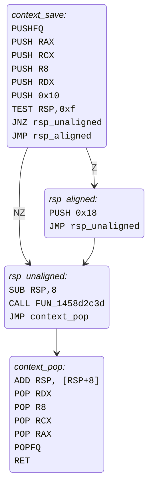

# 逆向 Arxan（现称 GuardIT）
本文重点探讨针对FROMSOFTWARE游戏中所采用的Arxan反调试与防篡改保护软件的逆向工程及去爪化(解除保护机制)技术。内容预设读者具备x86汇编语言、底层逆向工程、C语言及Rust编程的基础知识。

## 引言
如果你曾尝试将调试器附加到FROMSOFTWARE的游戏上，多半遭遇过随机崩溃的情况。同样，需要挂钩或修补游戏原生代码的模组开发者，很可能也经历过游戏崩溃，和/或他们植入的补丁在随机时间段后被游戏自动恢复的现象。

这些问题的根源是一款名为GuardIT的反调试与防篡改保护产品。不过该产品在玩家社区中更广为人知的是其旧称——Arxan（本文后续将沿用此名称进行指代）。自《黑暗之魂II：原罪学者》(Dark Souls II: SOTFS) 以来，FROMSOFTWARE已为其所有PC版本游戏部署了该保护系统（仅《只狼》除外）。其核心功能包括：

- **指令变异与控制流混淆**：通过改变指令结构及扰乱代码逻辑流，干扰反编译器工作并大幅增加逆向工程难度
- **敏感函数静态加密**：对静态存储中的关键函数进行加密，仅在执行时进行临时解密
- **多维度反调试检测**：采用多样化反调试手段检测调试器活动
- **敏感函数完整性校验**：对开发者标记的关键函数进行完整性验证，并在检测到篡改时执行以下组合应对措施：
    - 静默标记写入：将检测标记静默写入缓冲区供开发者读取，以便与反作弊系统联动。FROMSOFTWARE利用此功能封禁在线游戏中试图篡改代码的玩家
    - 可控崩溃触发：通过破坏栈空间或控制流的方式引发难以调试的崩溃
    - 代码自修复：自动恢复被修改的函数代码

<!-- markdown-link-check-disable -->

在逆向工程或制作模组过程中遭遇这些保护机制会带来严重阻碍。事实上，me3工具对《黑暗之魂III》的长期支持受阻，正是由于需要挂钩一个受Arxan代码完整性检查的函数。因此，找到能完全禁用该保护系统并确保所有Arxan逻辑停止运行的方法显得尤为重要。本文将详细阐述我逆向分析Arxan的核心历程：包括其代码注入可执行文件的原理、自我防护机制对抗篡改的策略，以及函数加密技术的运作方式，最终发布能够实时中和所有FROMSOFTWARE游戏中Arxan保护的Rust工具库——[dearxan](https://crates.io/crates/dearxan)。

<!-- markdown-link-check-enable -->

自0.8.0版本起， **me^3^** 已内置集成 `dearxan`功能, 用户可通过mod配置文件或命令行界面使用 `disable_arxan` 参数来禁用Arxan保护系统。

## 现有技术方案
Souls模组与游戏修改(cheating)社区曾多次尝试突破Arxan的保护机制。现有方案大多存在以下局限性：或仅针对特定功能（如代码完整性验证、代码修复或反调试），或仅支持有限游戏版本，或需手动定位Arxan问题代码的偏移量（且每个游戏版本都需重新定位）。

#### 《黑暗之魂3》与《黑暗之魂：重制版》的"反作弊绕过方案"
《黑暗之魂3》和《黑暗之魂：重制版》曾拥有非常活跃的在线游戏修改社区。许多修改手段需要挂钩受Arxan保护的游戏函数。在线游戏时若检测到此类篡改行为会导致封禁，因此部分开发者尝试通过半手动方式移除了大部分完整性检查。由此产生的"绕过方案"最初仅在小型修改者群体内部分享，但最终不可避免地泄露给越来越多的人。这些方案也被早期社区反作弊工具采用，例如[DS3 PvP Watchdog](https://www.nexusmods.com/darksouls3/mods/352)。

#### [MetalCrow](https://github.com/metal-crow)的DS1全面改造模组反制措施
[Dark Souls 1 Overhaul](https://github.com/metal-crow/Dark-Souls-1-Overhaul)旨在显著提升《黑暗之魂：重制版》的在线PvP体验。为防止用户因模组实施的代码修改遭到封禁，开发人员手动定位了代码完整性检查程序并通过补丁予以绕过([源码](https://github.com/metal-crow/Dark-Souls-1-Overhaul/blob/master/OverhaulDLL/src/AntiAntiCheat.cpp))。

#### [Yui](https://github.com/LukeYui)的防代码恢复补丁
[Yui](https://github.com/LukeYui)开发的[Seamless Co-op](https://www.nexusmods.com/eldenring/mods/510)需要数百个挂钩点才能正常运行，其中多数目标代码受Arxan防篡改代码恢复功能保护。她发现从《艾尔登法环》开始，这些检查例程（几乎？）全部通过常规游戏代码中的定时检查触发，很可能是出于性能优化考虑。判定是否执行单个检查的代码逻辑如下：

<a name="timed_restoration_check"></a>
```c linenums="1"
if (TIME_LEFT == 0.0f) {
    TIME_LEFT = get_random_delay_seconds(CHECK_FLAG);
}
else {
    TIME_LEFT -= 0.016666f; // one 60FPS frame
    if (TIME_LEFT <= 0.0f) {
        arxan_code_restoration_check();
    }
}
```

或者，在汇编中：
```nasm linenums="1" hl_lines="14"
MOVSS      XMM0,dword ptr [TIME_LEFT]
UCOMISS    XMM0,XMM6
JP         no_timer_reset
JNZ        no_timer_reset
MOV        ECX,0x10cd ; CHECK_FLAG
CALL       get_random_delay_seconds
MOVSS      dword ptr [TIME_LEFT],XMM0
JMP        check_end

no_timer_reset:
ADDSS      XMM0,dword ptr [NEGATIVE_ONE_OVER_SIXTY] 
MOVSS      dword ptr [TIME_LEFT],XMM0
COMISS     XMM6,XMM0
JC         check_end
LEA        RDX,[TIME_LEFT]
MOV        RCX,RBX
CALL       arxan_code_restoration_check

check_end:
```

值得关注的是，这种指令模式非常易于扫描识别，通过将最后的`JC`（条件跳转）指令替换为无条件跳转即可跳过检查([示例实现](https://github.com/tremwil/param_field_mapper/blob/master/src/arxan_disabler.cpp)).

鉴于该方案的简易性和实现便利性，若您的模组针对《艾尔登法环》或更新的FS社游戏，且仅需确保挂钩代码不被篡改，我们仍推荐采用此技术方案。

#### Dasaav的[ProDebug](https://github.com/Dasaav-dsv/ProDebug)方案
该DLL模组由[Dasaav](https://github.com/Dasaav-dsv)开发，通过模式扫描技术定位游戏代码中触发Arxan反调试检查的计时器。在《艾尔登法环》与《装甲核心6》中，这似乎是反调试例程运行的唯一入口点，使得该技术足以禁用（几乎？）全部反调试功能。

#### Maurice Heumann 的《黑色行动3》逆向工程研究
[Maurice Heumann](https://github.com/momo5502/)撰写的[这篇精彩技术文章](https://momo5502.com/posts/2022-11-17-reverse-engineering-integrity-checks-in-black-ops-3/)详细介绍了在《使命召唤：黑色行动3》中修补Arxan完整性检查的方案。由于我在自主研发Arxan禁用方案时未曾注意到这项研究，因此未验证该方法是否适用于FROMSOFTWARE旗下游戏。需要特别说明的是，该方案仅针对完整性检查机制，不涉及反调试例程或运行时函数加密功能。

## 项目动机
本项目启动于数月前应[Yui](https://github.com/LukeYui)的请求，当时她正将[无缝联机模组](https://www.nexusmods.com/eldenring/mods/510)移植至《黑暗之魂：重制版》。此前[所述](#yuis-anti-code-restoration-patches)的防止Arxan恢复已修改代码区域的技术在DSR中并不适用，因为代码恢复检查被植入到随机函数中，而非集中于专用的定时器例程。此外，多数代码完整性检查会直接导致游戏崩溃，因此仅修补恢复步骤仍不足够。

这使得该模组的开发受阻于如何全面禁用Arxan的代码完整性检查机制。虽然我了解[MetalCrow的先期研究](#metalcrows-ds1-overhaul-anti-anti-cheat)，但不愿依赖硬编码的检查地址列表。因此，我通过分析《艾尔登法环》特定模式所能发现的代码恢复例程结构，从零开始展开研究。

## Arxan存根（Stub）机制剖析

经分析发现，Arxan将其代码植入原始二进制文件的方式与运行时插桩（Runtime Instrumentation）工具的实现方式高度相似。我将这些独立的代码插入点命名为"Arxan存根"（Arxan stubs）。

### 总体结构

通过分析[基于定时器的代码恢复检查模式](#timed_restoration_check)中`arxan_code_restoration_check`的实例（《艾尔登法环》v1.16.0 @ 145c62312），可观察到如下结构：

```nasm linenums="1" hl_lines="3 7 13 15 17"
MOV     qword ptr [RSP + -0x8],RBX
LEA     RSP,[RSP + -0x8]
LEA     RBX,[LAB_14040e11c] ; (1)
MOV     qword ptr [RSP + -0x8],RAX
LEA     RSP,[RSP + -0x8]
MOV     RAX,qword ptr [RSP + 0x8]
MOV     qword ptr [RSP + 0x8],RBX=>LAB_14040e11c ; (2)
PUSH    RAX
POP     RBX
MOV     RAX,qword ptr [RSP]
LEA     RSP,[RSP + 0x8]
PUSH    R12
LEA     R12,[LAB_1459bfddb] ; (3)
PUSH    qword ptr [RSP]
MOV     qword ptr [RSP + 0x8],R12=>LAB_1459bfddb ; (4)
POP     R12
RET     =>LAB_1459bfddb ; (5)
```

1. 返回地址 `14040e11c` 被加载到 `RBX` 寄存器。
2. 返回地址被写入 `INIT_RSP - 8` 栈位置。
3. 调用地址 `1459bfddb` 被加载到 `R12` 寄存器。
4. 调用地址被临时压入栈中。
5. 调用地址从栈中弹出并跳转至该地址。

这段代码通过Arxan基于指令替换的混淆引擎进行了重度混淆。然而，通过跟踪栈指针及两个被引用的地址（第3和13行）及其用途，我们可以发现其最终执行结果是将`LAB_14040e11c`写入`RSP-8`位置，并跳转至`LAB_1459bfddb`。实际上，通过符号化执行这些操作，我们可以大幅简化这段代码：

```nasm
MOV     [RSP-0x08], LAB_14040e11c
MOV     [RSP-0x10], R12
MOV     [RSP-0x18], R12
LEA     RSP, [RSP - 8]
JMP     LAB_1459bfddb
```

若忽略对`R12`寄存器的栈破坏操作，可以观察到其核心行为是向栈中压入地址后执行跳转——这本质上正是调用(call)指令的功能！实际上，所有这些指令最终都等效于对以下代码的混淆伪装：

```nasm
CALL    LAB_1459bfddb
JMP     LAB_14040e11c
```

这种通用模式（将返回地址和调用地址移入栈中，然后通过`RET`指令跳转）被证明是识别Arxan混淆调用的有效特征。

其中，返回地址`LAB_14040e11c`指向一个看似随机的指令——该指令实际位于[Havok](https://en.wikipedia.org/wiki/Havok_(software))脚本执行相关函数的中间位置。跳转至该地址不仅无效，还必然会导致程序以难以调试的方式崩溃。

而当查看调用地址`LAB_1459bfddb`时，我们发现这又指向另一个混淆调用：

```nasm linenums="1" hl_lines="3 6"
LEA     RSP,[RSP + -0x8]
MOV     qword ptr [RSP],R14
LEA     R14,[LAB_141f3e1b3] ; (1)
XCHG    qword ptr [RSP],R14
PUSH    R9
LEA     R9,[LAB_144ff7fde] ; (2)
PUSH    RAX
MOV     RAX,qword ptr [RSP + 0x8]
MOV     qword ptr [RSP + 0x8],R9=>LAB_144ff7fde
MOV     R9,RAX
POP     RAX
RET     =>LAB_144ff7fde
```

1. 返回地址
2. 调用地址

同样地，返回地址（`141f3e1b3`，第3行）指向STL代码中`std::error_category::equivalent`函数内的随机指令。而调用地址则指向第三层混淆调用：

```nasm linenums="1" hl_lines="3 9"
LEA     RSP,[RSP + -0x8]
MOV     qword ptr [RSP],R11
LEA     R11,[LAB_145c97b12] ; (1)
PUSH    qword ptr [RSP]
MOV     qword ptr [RSP + 0x8],R11=>LAB_145c97b12
LEA     RSP,[RSP + 0x8]
MOV     R11,qword ptr [RSP + -0x8]
PUSH    R11
LEA     R11,[LAB_14515620d] ; (2)
PUSH    qword ptr [RSP]
MOV     qword ptr [RSP + 0x8],R11=>LAB_14515620d
POP     R11
RET     =>LAB_14515620d
```

1. 返回地址
2. 调用地址

此处使用的返回地址`145c97b12`（第3行）较难识别，因其指向的代码段经过高度混淆处理。但经过仔细分析后可再次确认，该地址同样指向常规游戏函数中的某个中间指令。而调用地址`14515620d`（第9行）则指向了更值得关注的内容：

```nasm hl_lines="11 14 16 23-26 32"
PUSHFQ
LEA     RSP,[RSP + -0x8]
MOV     qword ptr [RSP],RAX
MOV     qword ptr [RSP + -0x8],RCX
LEA     RSP,[RSP + -0x8]
MOV     qword ptr [RSP + -0x8],R8
LEA     RSP,[RSP + -0x8]
MOV     qword ptr [RSP + -0x8],RDX
LEA     RSP,[RSP + -0x8]
PUSH    0x10
TEST    RSP,0xf ; (1)
LEA     RSP,[RSP + -0x8]
MOV     qword ptr [RSP],RSI
MOV     RSI,LAB_1404e6f39 ; (2)
PUSH    qword ptr [RSP]
MOV     qword ptr [RSP + 0x8],RSI=>LAB_1404e6f39 ; (3)
LEA     RSP,[RSP + 0x8]
MOV     RSI,qword ptr [RSP + -0x8]
MOV     qword ptr [RSP + -0x8],RBX
LEA     RSP,[RSP + -0x8]
LEA     RSP,[RSP + -0x8]
MOV     qword ptr [RSP],RAX
MOV     RBX,qword ptr [RSP + 0x10] => LAB_1404e6f39 ; (4)
MOV     RAX,LAB_140bd28e4 ; (5)
CMOVNZ  RBX,RAX ; (6)
MOV     qword ptr [RSP + 0x10],RBX ; (7)
MOV     RAX,qword ptr [RSP]
LEA     RSP,[RSP + 0x8]
MOV     RBX,qword ptr [RSP]
LEA     RSP,[RSP + 0x8]
LEA     RSP,[RSP + 0x8]
JMP     qword ptr [RSP + -0x8] ; (8)
```

1. 若`RSP`是 16 的倍数，则设置`Z`零）标志位。
2. 将“零(zero)”路径地址(`1404e6f39`)加载到`RSI`寄存器。
3. 将零(zero)路径地址移至栈上。
4. 从栈中将零(zero)路径地址加载到`RBX`寄存器。
5. 将“非零(nonzero)”路径地址 (`140bd28e4`) 加载到`RAX`寄存器。
6. 若`Z`标志位未设置（即`RSP`不是 16 的倍数），则将非零路径地址（当前位于`RAX`）移动到`RBX`（当前持有零路径地址）。此时`RBX`包含条件分支的目标地址。
7. 将条件分支地址（当前位于`RBX`）移至栈上。
8. 跳转至写入栈中的条件分支地址。

该代码块经过深度混淆，但我们仍可通过逐一解析指令艰难地识别出其本质——这主要是一个经过混淆处理的条件跳转指令：

```nasm
PUSHFQ
PUSH    RAX
PUSH    RCX
PUSH    R8
PUSH    RDX
PUSH    0x10
TEST    RSP,0xf
JNZ     LAB_140bd28e4
JMP     LAB_1404e6f39
```

此代码段的首部与部分上下文保存的实现高度相似。通过进一步分析各分支路径并进行去混淆处理，我们得到以下控制流图，该图证实了这一推断：

<a name="stub_cfg"></a>



通过仔细跟踪栈操作过程，我们可以发现`PUSH 0x10`和`PUSH 0x18`指令的作用是通过`context_pop`中的`ADD RSP, [RSP+8]`指令恢复栈的原始对齐状态。虽然这种栈对齐技术并不常见（通常采用无分支方式，即将`RSP`暂存至临时寄存器并清除其最低4位），但这确实是插桩技术的典型模式：将当前CPU状态保存到栈中，调用插桩例程（此处即调用`FUN_1458d2c3d`，该函数很可能负责代码恢复逻辑），最后恢复原始状态。

然而，这里存在一个关键问题：由于前三次混淆调用使用了伪造的返回地址，最终的`RET`指令会将执行流重定向到无关函数的中间地址，这必然导致游戏崩溃。因此我推测，在`FUN_1458d2c3d`函数中必然存在会覆盖这些"虚假"返回地址的写入操作。虽然我尝试手动跟踪该函数的逻辑，但其混淆手段成功阻断了Ghidra和IDA反编译器/控制流图分析工具的工作流程，使得手动分析难以继续进行。

### 模式识别
在尚未找到更优分析方案或去混淆策略时，我转而尝试寻找更简单的"Arxan存根"。从上述控制流图可以推断，这很可能是Arxan向游戏代码插入逻辑的标准方式，因此我开始进行模式扫描。

此时，Arxan对`TEST RSP, 0xf`指令的使用反而成了他们的阿喀琉斯之踵。正如前文所述，这是一种非常罕见的栈对齐方式，我难以想象还有其他场景会生成这样的指令。果不其然，在二进制文件中搜索其字节序列`48 f7 c4 0f 00 00 00`后，得到了1598个匹配结果。在逐一检查了数十个样本后，我发现它们都遵循完全相同的上下文保存与恢复模式！通过分析更多样本，事实变得显而易见：Arxan开发者确实试图增加这些存根的查找难度。

- **寄存器操作随机化**：存根中对寄存器进行压栈（PUSH）和出栈（POP）操作的顺序是随机化的。
- **保存寄存器数量不定**：不同存根保存的寄存器数量各不相同，有时仅保存少量通用寄存器（GPRs），有时会保存全部通用寄存器，甚至有时还会额外保存XMM寄存器。
- **栈帧布局随机填充**：即使压入相同数量的寄存器，存根也可能在栈中保存的上下文数据之间随机插入"空隙"（填充数据）。
- **基础块分割策略**：原始的基础块通常被分割成由少量指令组成的小块，这种设计很可能旨在防御基于模式的扫描检测。
- **未混淆存根大量存在**：值得注意的是，大量存根完全未进行混淆处理，其控制流结构与上文展示的[去混淆后CFG](#stub_cfg)高度相似。这些未混淆的存根省略了三个用于引导至上下文保存阶段的混淆性"虚假"调用。

### 返回指令片段分析
在获得定位所有存根的方法后，我重返《黑暗之魂：重制版》继续分析，因为该游戏是我需要优先支持的目标。通过`TEST RSP, 0xf`模式匹配，在该游戏中发现了2976处匹配（这个数量恰好高于FS社其他所有游戏）。为查明覆盖伪造返回地址的写入操作，我使用Rust绑定的[Unicorn](https://www.unicorn-engine.org/)模拟器从`TEST RSP, 0xf`指令开始单步执行存根代码，同时记录所有向原始RSP上方栈地址执行写入操作的指令，最终发现了如下指令块（高位栈写入操作已高亮）：

```nasm hl_lines="4 9 14"
MOV     RAX,qword ptr [LAB_14009f568]       = 0x32
MOV     RDX,qword ptr [RBP + 0x50]
MOV     RCX,qword ptr [PTR_LAB_140095c28]   = 0x1400e0f5a
MOV     qword ptr [RDX + RAX*0x8],RCX=>LAB_1400e0f5a

MOV     RAX,qword ptr [DAT_140663c78]       = 0x31
MOV     RDX,qword ptr [RBP + 0x50]
MOV     RCX,qword ptr [PTR_LAB_141056011]   = 0x140997167
MOV     qword ptr [RDX + RAX*0x8],RCX=>LAB_140997167

MOV     RAX,qword ptr [DAT_140a6ccf7]       = 0x30
MOV     RDX,qword ptr [RBP + 0x50]
MOV     RCX,qword ptr [PTR_LAB_14012f813]   = 0x14026c7d5
MOV     qword ptr [RDX + RAX*0x8],RCX=>LAB_14026c7d5
```

通过分析`LAB_1400e0f5a`可以发现，该处含有一条`JMP`(跳转)指令，指向另一个混淆化Arxan存根的起始位置（即包含三个重复混淆调用及伪造返回地址的结构）。另外两个指令片段`LAB_140997167`和`LAB_14026c7d5`实质上是经过混淆处理的返回指令，其表现形式类似`LEA RSP, [RSP + 8]; JMP qword ptr [RSP - 8]`。通过模拟执行可验证：当存根的上下文恢复部分执行完毕后，系统会依次跳转经过这些返回指令片段，最终抵达`LAB_1400e0f5a`的真实出口地址。

在对更多存根进行分析后，发现其写入模式具有一致性：通过将固定偏移量（存于`RAX`）与原始栈帧地址（存于`RDX`/`[RBP + 0x50]`)相加，可定位到伪造调用返回地址的栈位置，并用指令片段的地址覆盖该值。尽管由于初始配置的Unicorn模拟器无法遍历所有存根导致样本量有限，但我仍观察到以下现象：

- **固定三次伪造调用**：始终存在三个经过混淆的伪造调用，因此需要覆盖三个返回地址。
- **前两个为混淆化返回指令**：按栈顺序排列的前两个地址会被替换为经过混淆处理的`RET`指令片段。
- **末位执行跳转中转**：最后一个地址实际作为跳板，负责将执行流返还至非Arxan的正常代码区域。
- **写入操作具有离散性**：对这些地址的写入操作并非集中进行，在复杂存根中可能被大量控制流混淆逻辑分隔。
- **存根链式调用机制**：存根之间可形成链式调用，前一个存根的出口跳板会直接跳转至下一个存根的起始位置。

尽管并非完美，但结合Arxan的控制流混淆技术，这种机制能有效防止通过简单NOP调用存根主例程的攻击——因为若不借助模拟器辅助的控制流分析，几乎不可能定位到出口跳板地址。 

### 总结
通过分析我们发现，Arxan通过名为"Arxan存根"的独立代码单元将保护逻辑注入目标程序。每个存根执行特定功能，包括反调试检测、代码完整性验证等。部分存根具有防NOP攻击保护机制——这类存根我称之为混淆化存根，以区别于非混淆化存根，因为存根中上下文保存/恢复部分是否采用混淆处理，完全取决于是否存在此类保护机制。存根的基本结构如下：

1. **混淆化存根起始结构**：若属*混淆化存根*，存根起始处为3层嵌套的`CALL ..., JMP {伪造地址}`混淆指令块序列
2. **寄存器保存与栈对齐**：将需要保存的寄存器压入栈中，随后将栈指针按16字节对齐
3. **核心逻辑执行机制**：通过`CALL`指令（可能被混淆）调用存根的实际逻辑例程。若为*混淆化存根*，该例程成功执行后会覆盖第1步中3个伪造返回地址，写入正确的返回指令片段
4. **上下文恢复阶段**：恢复对齐前的原始栈指针，并还原所有已保存的寄存器
5. **执行流返回方式**：通过相对偏移`JMP`（非混淆化存根）或可能被混淆的`RET`指令（混淆化存根）将执行权交还非Arxan代码

## 存根分析
在掌握Arxan存根的结构特征与有效定位方法后，下一步是制定阻止其运行的方案。思路非常明确：

1. **定位存根**：通过搜索`TEST RSP, 0xf`指令定位所有存根入口。
2. **解析核心逻辑**：沿控制流回溯至可能被混淆的`CALL`指令，提取存根主函数及其返回地址（即上下文恢复段起始点）。
3. **处理混淆化存根**：若存根经过混淆，需分析主函数的控制流图以定位3个正确的返回指令片段。
4. **植入拦截逻辑**：在`TEST RSP, 0xf`指令处植入钩子代码，使其在跳转至上下文恢复段前。

此方案的核心挑战在于：Arxan的控制流混淆技术会阻止传统的深度优先搜索（DFS）控制流图构建方法。要准确追踪分支路径，必须对机器状态进行部分模拟分析。

### 尝试一：简单启发式方法
我的初步构想是基于静态控制流遍历控制流图（CFG），并乐观假设所有访问到的加载到代码区地址的`LEA`或`MOV`指令均属于分支混淆机制的一部分，将这些地址压入待访问栈。随后可通过[前文](#return-gadgets)发现的指令模式来识别返回指令片段：

```nasm
MOV     RAX,qword ptr [RIP+?]
MOV     RDX,qword ptr [RBP + ?]
MOV     RCX,qword ptr [PTR_TO_GADGET_ADDR]
MOV     qword ptr [RDX + RAX*0x8],RCX
```

这种方法的优势在于实现简单。然而，存在若干难以规避的障碍导致其实际应用受限：

- **基础块分割干扰**：Arxan经常将基础块分割成细小的片段，且连接这些片段的跳转指令可能被混淆。上述4指令模式同样可能遭遇这种分割，导致模式匹配失败。虽然常规的`jmp`指令容易识别，但遇到混淆跳转时仍需部分模拟——而这正是本技术试图规避的。

- Arxan会利用`.text`节中的空隙区域（code caves）存储用于比对的哈希值及某些状态数据。这些数据区域的地址可能被错误识别为代码指针。多数情况下这不会造成问题，因为反汇编器最终会遇到无效指令。但在极少数情况下，这些数据可能被解析为足够长的有效x86指令序列，从而跳转至完全无关的函数或存根——并在其中错误匹配上述指令模式。

### 尝试二：Unicorn模拟器方案
另一种方案是直接采用专业的x86模拟器（Unicorn Emulator），通过配置最小化状态和模拟环境，逐步执行存根代码直至`RSP`指针超越`TEST RSP, 0xf`指令设置的初始值。随后可通过扫描栈空间提取返回指令片段并生成补丁。

实际上，我已经利用Unicorn模拟器构建了一个最小化可行方案，此前正是通过该方案发现了真实返回地址被写入栈的机制。具体配置包括：将游戏可执行文件映射到其首选基地址，并分配大容量内存块作为模拟栈空间。除`RSP`外所有寄存器初始化为0，从`TEST RSP, 0xf`指令开始执行模拟。这种配置对相当数量的存根有效，但当试图覆盖所有存根时，问题迅速显现：

- 该方案存在明显局限性：首先执行效率较低——部分存根需数百毫秒才能完成模拟，对于需要在游戏启动时实时处理3000个存根的场景而言显然不适用（当然静态分析仍可行）。
- 某些存根会通过游戏自身的`malloc`函数进行堆内存操作，这就需要模拟堆分配机制。
- 更关键的是，反调试存根大量使用了需要深度模拟WinAPI或结构化异常处理（SEH）的技术，包括：[`INT3`](https://anti-debug.checkpoint.com/techniques/assembly.html#int3), [`INT 2d`](https://anti-debug.checkpoint.com/techniques/assembly.html#int2d), [`IsDebuggerPresent`](https://anti-debug.checkpoint.com/techniques/debug-flags.html#using-win32-api-isdebuggerpresent), [`NtQueryInformationProcess`](https://anti-debug.checkpoint.com/techniques/debug-flags.html#using-win32-api-ntqueryinformationprocess), [`NtGlobalFlag`](https://anti-debug.checkpoint.com/techniques/debug-flags.html#manual-checks-ntglobalflag), [`GetThreadContext`](https://anti-debug.checkpoint.com/techniques/process-memory.html#hardware-breakpoints)，以及添加/删除向量化异常处理程序等。此外，存根还经常通过组合调用`GetModuleHandleA`和`GetProcAddress`来动态获取函数地址。

我花费了一两天时间配置Unicorn模拟器的钩子函数，试图构建能完全运行所有存根的沙箱环境，但最终意识到这可能是徒劳的——因为对于实际需求而言，并不需要对存根进行百分之百精确的模拟。

### 尝试三：部分分支模拟器方案
最终我决定基于[`iced-x86`](https://docs.rs/iced-x86)反汇编器构建一个专用于破解Arxan控制流混淆的定制化x86模拟器。该模拟器能处理部分信息（允许寄存器或内存值处于未知/无效状态），并在条件分支处进行执行路径分叉，从而探索所有可能的执行路径。

该CPU模型极度简化但满足需求：

- **内存管理**：采用惰性内存映射机制，所有内存区域均可读写。
- **寄存器建模**：仅模拟通用寄存器（RAX-R15），段寄存器CS/DS/ES/SS预设为零值，从其他段读取数据会使目标操作数失效。
- **指令读取**：仅允许从*不可变*的可执行镜像中读取指令，不支持自修改代码。
- **标志位处理**：不模拟`EFLAGS`寄存器，条件分支指令（如`Jcc`）和数据指令（如`CMOVcc`）始终将程序执行分叉为两条路径。
- **中断处理**：不模拟中断机制，遇到中断指令直接终止当前分叉。
- **指令集支持**：完整模拟最小指令子集（`MOV`, `MOVZX`, `LEA`, `XCHG`, `ADD`, `SUB`, `PUSH`, `POP`, `JMP`, `CALL`, `RET`），其他指令会根据iced的[`InstructionInfoFactory`](https://docs.rs/iced-x86/latest/iced_x86/struct.InstructionInfoFactory.html)输出结果使其写入的寄存器/内存失效

#### 程序状态布局
通用寄存器存储在固定的`Option<u64>`类型数组中，根据其在iced的`Registers`枚举中相对于`RAX`的偏移量进行索引。
```rs
#[derive(Default, Clone)]
pub struct Registers([Option<u64>; Self::GPR_COUNT]);
```

可执行镜像被抽象至所需最小程度，通过以下特征实现： 
```rs
/// Abstraction over an immutable view of a mapped executable image.
pub trait ImageView: Clone {
    /// The actual base address of the image.
    fn base_va(&self) -> u64;

    /// Iterate over the virtual address and bytes of each section of the image.
    fn sections(&self) -> impl Iterator<Item = (u64, &[u8])>;

    /// Iterate over the RVAs of all 64-bit relative relocations of the image.
    ///
    /// May fail with an opaque error if the relocations section of the image 
    /// is corrupted.
    fn relocs64(&self) -> Result<impl Iterator<Item = u32>, BadRelocsError>;

    /// Attempt to read at least `min_size` bytes at the virtual address `va`.
    ///
    /// Returns the longest possible contiguous readable slice, and [`None`] 
    /// if the address is out-of-bounds or less than `min_size` bytes can be 
    /// read.
    fn read(&self, va: u64, min_size: usize) -> Option<&[u8]>;
}
```

目前`relocs64()`方法看似无用，但在处理运行时加密函数时将发挥关键作用。

内存状态通过虚拟地址索引的64字节块`HashMap`来表示。每个块使用64位位掩码来追踪已知字节与未知字节的状态：

```rs
#[derive(Debug, Clone)]
struct MemoryBlock {
    bytes: [u8; Self::SIZE], // Note: Self::SIZE == 64
    is_known: bitvec::BitArr!(for Self::SIZE),
}

#[derive(Clone)]
pub struct MemoryStore<I: ImageView> {
    blocks: FxHashMap<usize, MemoryBlock>,
    image: I,
}
```

来自可执行镜像的内存块在读取时会惰性复制到哈希映射中，且仅当切片内所有字节均为已知状态时读取操作才会成功。

程序状态由内存状态、寄存器值、指令指针及可选用户数据组合而成： 

```rs
/// The full state of an emulated program.
///
/// This state fetches instructions and static memory from an [`ImageView`] implementation. It also
/// allows attaching extra data to the `user_data` field that can be used for higher-level logic.
#[derive(Debug, Clone)]
pub struct ProgramState<I: ImageView, D: Clone = ()> {
    /// The instruction pointer, if known.
    pub rip: Option<u64>,
    /// The state of general-purpose registers.
    pub registers: Registers,
    /// The state of the virtual memory of the program.
    pub memory: MemoryStore<I>,
    /// An extra field which may be used to attach additional state to the program.
    pub user_data: D,
}
```

#### 分叉算法

核心思路是对所有控制流图（CFG）执行路径进行深度优先搜索。维护一个程序状态栈，每次模拟栈顶状态的单条指令。若遇到条件分支或条件移动指令，则克隆当前状态并将其压入栈中。若遇到中断或导致`state.rip`变为`None`的情况，则从栈中弹出该状态。在此过程中可同步记录其他元数据，如当前执行路径和分叉点。

所有状态及附加信息通过以下`RunStep`结构体以可变引用形式传递给用户回调函数：

//// collapse-code
```rs
#[allow(dead_code)]
pub struct RunStep<'a, I: ImageView, D: Clone = ()> {
    /// The current instruction being executed.
    pub instruction: &'a mut Instruction,
    /// An [`InstructionInfoFactory`] which can be used to compute register 
    /// and memory accesses for the instruction.
    pub info_factory: &'a mut InstructionInfoFactory,
    /// The current state of the program being emulated.
    pub state: &'a mut ProgramState<I, D>,
    /// The past forks created when conditional branch/data instructions were 
    /// encountered.
    pub past_forks: &'a mut [PastFork<I, D>],
    /// The full execution path (virtual address of instructions) the program 
    /// took to arrive at its current state.
    pub execution_path: &'a [u64],
    /// The number of conditional branch/writes that have been encountered on 
    /// this path since execution began.
    pub branch_count: usize,
    /// The index of the instruction in the execution path at which this 
    /// program state was forked from another. Zero if this is the initial p
    /// rogram state.
    pub fork_index: usize,
    /// The index of the last conditional branch/data instruction in the 
    /// execution path. The overall execution history after this point is 
    /// guaranteed to be linear.
    pub basic_block_index: usize,
}

/// Represents a past point in program execution where execution forked in two 
/// as a result of a conditional branch/data instruction.
#[derive(Debug)]
pub struct PastFork<I: ImageView, D: Clone = ()> {
    /// The current state of the program (excluding any steps belonging to 
    /// more recent forks).
    pub state: ProgramState<I, D>,
    /// The index (e.g. time) of the instruction in the execution path since 
    /// the last conditional data/branch instruction.
    pub basic_block_index: usize,
    /// The index of the instruction in the execution path at which this fork 
    /// was created.
    pub fork_index: usize,
    /// The number of conditional branch/writes that have been encountered on 
    /// this path since execution began.
    pub branch_count: usize,
}
```
////

</details>

为实现更高层次的分析，回调函数可直接修改`RunStep`的字段，并通过`StepKind`结构体决定后续执行流程：

```rs
#[derive(Debug, Clone)]
#[allow(clippy::large_enum_variant)]
pub enum StepKind<I: ImageView, D: Clone = (), R = ()> {
    /// Single-step emulation of the current instruction.
    SingleStep,
    /// End execution of the current program state fork.
    ///
    /// Next step, execution of the parent program state will resume.
    StopFork,
    /// Do not emulate the current instruction or update the instruction pointer,
    /// allowing fine-grained control over program state modifications.
    ///
    /// If a new program state is provided, emulation will fork to it, resuming
    /// execution of the current program state once an invalid instruction 
    /// pointer is reached or [`StepKind::StopFork`] is received.
    Custom(Option<ProgramState<I, D>>),
    /// Stop emulating all program forks, returning the provided value.
    Stop(R),
}
```

分叉模拟器方案的核心问题在于需要穷尽Arxan存根中的所有独立执行路径。若存在循环结构则会产生无限路径，否则路径数量可能随条件分支指令呈指数级增长。由于不能使用全局已访问指令集合（这会阻碍混淆化条件跳转的分支探索），我采用的初级解决方案是：根据当前执行路径动态追踪访问记录，并通过硬编码合理的分支深度和分叉深度限制来控制指数级复杂度。

当任意执行路径抵达存根的上下文保存段时，立即扫描`RSP`上方的栈内存以提取返回指令片段。一旦集齐3个片段即可终止搜索。

该方案在《黑暗之魂：重制版》和《黑暗之魂2》中表现卓越——单线程仅用不到1秒就完成了DSR全部2976个存根的返回指令片段提取。这项技术已应用于[`arxan-disabler`](https://github.com/tremwil/arxan-disabler)组件（即dearxan的前身，初期仅支持上述两款游戏）。

### 遍历存根完整控制流图

然而，当我决定支持其他FS社游戏时，该方案显现出局限性。新游戏的存根结构变得更加复杂，分支深度显著增加，遍历所有执行路径的计算成本已变得难以承受。因此我必须设计一种与指令数量呈线性关系的新方案。标准解决方案是维护已访问指令集合并在遇到重复指令时终止当前分叉，但需针对混淆控制流进行若干调整：

#### 基于RSP的条件分支
需要重申的是：存根的上下文保存部分会根据`TEST RSP, 0xf`的结果进行分支跳转，这是其栈对齐机制的组成部分。由于未模拟`EFLAGS`寄存器，分叉模拟器最终会访问到与初始RSP值不匹配的错误分支路径。这种情况始终发生在首个分支处，幸运的是其检测机制相对简单：

```rs
// Ignore the RSP-aligning first branch path that doesn't correspond to the
// actual RSP value
let ignored_test_rsp_branch = match init_state.registers.rsp() {
    Some(rsp) if rsp.is_multiple_of(16) => 1,
    _ => 0,
};

init_state.run(move |mut step| {
    // Don't execute the incorrect RSP alignment branch
    if (step.branch_count, step.past_forks.len()) == (1, ignored_test_rsp_branch) {
        log::trace!("Ignoring unreachable RSP alignment branch");
        return StepKind::StopFork;
    }
    // ...
})
```

在混淆化存根中，当计算原始栈帧地址以写入返回指令片段时，会存在第二个依赖于RSP的分支。该分支会检查在调用存根主例程前是否已向栈中压入`0x18`字节。虽然我们仍可通过`branch_count`和`past_forks.len()`参数忽略此分支，但由于该分支在非混淆化存根中根本不存在，使得解决方案显得更为取巧：

```rs
// Obfuscated stub call routines will first check if we pushed 18 earlier.
// We need to make sure to take the correct branch here too
if step.branch_count == 1
    && step.instruction.code() == Code::Cmp_rm64_imm8
    && step.instruction.op0_register() == Register::RAX
    && step.instruction.immediate8() == 0x18
{
    bad_cmp_rax_branch = Some(2 * ignored_test_rsp_branch);
}
if step.branch_count == 2 && Some(step.past_forks.len()) == bad_cmp_rax_branch {
    log::trace!("Ignoring unreachable RSP alignment return fixup branch");
    return StepKind::StopFork;
}
```

#### 混淆化条件跳转
对于使用`CMOVxx`指令的混淆化条件分支，需要在执行`CMOV`后重新访问公共路径，直到指令指针与前次分支发生偏离。为此，我们维护一个全局（即每次模拟独享的）已访问指令IP到"cmov ID"的映射表，以及一个全局的`is_double_stepping`（双重步进）标志位。每次处理已知真假分支值的cmov指令时，按如下规则分配新ID：

```rs
cmov_id_counter += 3;
true_branch_id = cmov_id_counter;
false_branch_id = cmov_id_counter + 1;
```

该ID会被存储在`ProgramState`的`user_data`字段中。当遇到已访问过的指令时，通过检查其分配的cmov ID是否恰好比当前状态ID小1，即可判断是否处于假分支执行路径。此时允许重新执行该指令，直到执行路径发生分离：

//// collapse-code
```rs
// Keep track of visited instructions
match visited.entry(step.instruction.ip()) {
    Entry::Occupied(mut e) => {
        let cmov_id = e.get_mut();

        // Only double step instructions when:
        // - instruction immediately follows the latest cmov branch
        // - no conditional branch instruction has been invoked yet
        let is_cond = step.instruction.flow_control() == FlowControl::ConditionalBranch;
        if !is_cond && step.state.user_data.cmov_id.is_prev_of(cmov_id) {
            log::trace!("double stepping");
            is_double_stepping = true;
        }
        else {
            return StepKind::StopFork;
        }
    }
    Entry::Vacant(e) => {
        if is_double_stepping {
            log::trace!("double stepping path diverged");
            is_double_stepping = false;
            // Sets cmov_id to the "null" value (u64::MAX)
            step.state.user_data.cmov_id.detach();
        }
        e.insert(step.state.user_data.cmov_id);
    }
};
```
////

#### 混淆化调用
分叉模拟器对`CALL`指令的实现方式与真实x86 CPU一致：将下一条指令地址压入栈中，并将`RIP`设置为调用目标地址。因此要从`CALL`指令返回，模拟器必须沿着执行路径通过`RET`指令完成返回。

当同一函数被多次调用时，当前分叉会在未跳转到调用返回地址的情况下被终止，这就产生了问题。解决此问题需要检测通过间接`JMP`或`RET`指令实现的混淆化调用。[Dasaav](https://github.com/Dasaav-dsv)提出了利用栈对齐进行检测的创新方案，最终取得显著成效：

//// collapse-code
```rs
/// Information about a possibly-obfuscated call instruction.
pub struct CallInfo {
    /// The value of RSP after taking the call.
    pub target_rsp: u64,
    /// The value of RSP after returning from the call.
    pub return_rsp: u64,
    /// The call's target function.
    pub target_ip: Option<u64>,
    /// The return address to jump to after returning from the called function.
    pub return_ip: Option<u64>,
}

impl CallInfo {
    /// Attempt to extract call information from the current execution step.
    ///
    /// The instruction triggering this may not necessarily be a call instruction.
    /// Heuristics regarding the stack and its alignment make detecting calls obfuscated
    /// via jump or return instructions possible.
    pub fn from_step<I: ImageView, D: Clone>(step: &RunStep<I, D>) -> Option<Self> {
        // rsp must be known to analyze calls
        let rsp = step.state.registers.rsp()?;

        match step.instruction.flow_control() {
            // If RSP is call-aligned after a return/indirect branch, assume an obfuscated call.
            FlowControl::Return => {
                let target_rsp =
                    rsp.wrapping_add_signed(step.instruction.stack_pointer_increment() as i64);

                (target_rsp & 0xF == 8).then(|| Self {
                    target_rsp,
                    return_rsp: target_rsp.wrapping_add(8),
                    target_ip: step.state.memory.read_int(rsp, 8),
                    return_ip: step.state.memory.read_int(target_rsp, 8),
                })
            }
            FlowControl::IndirectBranch => (rsp & 0xF == 8).then(|| Self {
                target_rsp: rsp,
                return_rsp: rsp.wrapping_add(8),
                target_ip: step.state.get_operand_value(step.instruction, 0),
                return_ip: step.state.memory.read_int(rsp, 8),
            }),
            FlowControl::Call | FlowControl::IndirectCall => Some(Self {
                target_rsp: rsp
                    .wrapping_add_signed(step.instruction.stack_pointer_increment() as i64),
                return_rsp: rsp,
                target_ip: if step.instruction.flow_control() == FlowControl::IndirectCall {
                    step.state.get_operand_value(step.instruction, 0)
                }
                else {
                    Some(step.instruction.near_branch_target())
                },
                return_ip: Some(step.instruction.next_ip()),
            }),
            _ => None,
        }
    }
}
```
////

现在，当检测到可解析的间接分支实质为混淆化`CALL`指令时，可主动检查其目标地址是否存在于已访问列表，从而决定是否继续执行至返回地址：

```rs
if oob_or_visited {
    log::trace!("skipping detected call at {:x}", step.instruction.ip());
    *step.state.registers.rsp_mut() = Some(call.return_rsp);
    step.state.rip = Some(return_ip);

    // Clear volatile registers, since we don't know what the function did
    for &r in VOLATILE_REGS {
        *step.state.registers.gpr64_mut(r) = None;
    }
    StepKind::Custom(None)
}
```

#### 反调试返回地址破坏技术
在《黑暗之魂重制版》之后版本游戏中使用的Arxan保护方案，其反调试函数存根采用了一种新的进程崩溃机制：通过使用指向无效内存的地址覆盖主逻辑函数的返回地址。这个问题尤为棘手，因为该函数采用通用的"结束"代码块——如果先执行"异常"路径（实际执行情况），那么即使后续执行"正常"路径，由于会再次经过已执行的指令，函数同样无法正常返回。

此时在`RunStep`过程中追踪完整执行路径及分叉点与分支点的价值就得以体现。我们可以为每个已执行指令额外存储一个`is_unresolved_branch`布尔标志位（与条件cmov ID关联）。当遇到未解析的间接分支或`RET`指令时，当前基本块内的所有指令都会被打上这个标志。

//// collapse-code
```rs
// If we didn't fork and somehow ended up at no rip while single-stepping
// an indirect branch or return, set the unresolved flag on all 
// instructions in the basic block
let maybe_fork = step.single_step();
let indirect = matches!(
    step.instruction.flow_control(),
    FlowControl::IndirectBranch | FlowControl::Return
);
if maybe_fork.is_none() && indirect && step.state.rip.is_none() {
    let last_block = step.basic_block();

    log::trace!(
        "Unresolved jump/ret at {:x}, allowing revisits from {:x?}",
        step.instruction.ip(),
        last_block.first()
    );

    for ip in last_block {
        visited.get_mut(ip).unwrap().set_unresolved_branch(true);
    }
}
```
////

随后，可对已访问指令的检查机制进行修订：若发现未解析分支标志被设置，则清除该标志并允许重新访问该指令：

//// collapse-code
```rs hl_lines="5-9 18 20-28"
match visited.entry(step.instruction.ip()) {
    Entry::Occupied(mut e) => {
        let cfg_info = e.get_mut();

        // Clear the unresolved branch flag if set
        let mut allow_visited = cfg_info.unresolved_branch();
        if allow_visited {
            cfg_info.set_unresolved_branch(false);
        }

        // Only double step instructions when:
        // - instruction immediately follows the latest cmov branch
        // - no conditional branch instruction has been invoked yet
        let is_cond = step.instruction.flow_control() == FlowControl::ConditionalBranch;
        if !is_cond && step.state.user_data.cfg_info.is_prev_of(cfg_info) {
            log::trace!("double stepping");
            is_double_stepping = true;
            allow_visited = true;
        }
        else if allow_visited && is_double_stepping {
            log::trace!("double stepping path diverged");
            is_double_stepping = false;
            step.state.user_data.cfg_info.detach_cmov_pair();
        }

        if !allow_visited {
            return StepKind::StopFork;
        }
    }
    Entry::Vacant(e) => {
        if is_double_stepping {
            log::trace!("double stepping path diverged");
            is_double_stepping = false;
            step.state.user_data.cfg_info.detach_cmov_pair();
        }
        e.insert(step.state.user_data.cfg_info);
    }
};
```
////

虽然该方法足以应对直至《艾尔登法环》时期游戏中的反调试函数存根，但在处理《装甲核心6》和《艾尔登法环：黑夜君临》时则显不足。Arxan开发者很可能调整了逻辑机制，使得返回地址的破坏时机大幅提前——早在真正返回前的多个条件分支处就已发生。 

我尝试通过实时检测模拟过程中的"初始栈帧之上写入"操作来修复该问题，而非被动等待主存根例程执行返回。这种方法取得部分成效，但在处理《装甲核心6》和《艾尔登法环：黑夜君临》的某些存根时，有一个返回指令片段始终无法被检测到，这很可能是由于在访问写入该指令片段的指令*之前*，系统就先调用了嵌套的反调试检查。

幸运的是，事实证明我实际上并不需要这个指令片段的地址。

### 一个重要发现
迄今为止，我的工作始终基于一个保守假设：三个返回指令片段可能以任意顺序被存根主例程写入。然而经过仔细分析后发现，它们...

- 总是按照栈地址降序进行写入
- 始终将第二和第三个指令片段设置为类`RET`指令序列，因此实际上只有第一个指令片段具有关键意义 :facepalm:

这使得分析工作大幅简化。我们只需捕获第一个"初始栈帧之上"的写入操作即可，因此即使存根控制流图（CFG）中某些深奥的嵌套路径未被访问也无关紧要：

//// collapse-code
```rs
/// Search for the instruction writing a return gadget.
/// this is a code pointer written above the stub's stack-saved context
fn extract_return_gadget<I: ImageView, D: Clone>(
    &self,
    step: &RunStep<I, D>,
) -> Option<ReturnGadget> {
    if step.instruction.code() != Code::Mov_rm64_r64
        || step.instruction.op0_kind() != OpKind::Memory
    {
        return None;
    }
    let write_addr = step.state.virtual_address(step.instruction, 0)?;
    let address = step.state.get_operand_value(step.instruction, 1)?;
    let stack_offset = write_addr.checked_sub(self.init_rsp)? as usize;

    // make sure it's not a write to unrelated memory that happens to be above
    // our initial RSP
    (stack_offset < 0x400).then_some(ReturnGadget {
        stack_offset,
        address,
    })
}
```
////

## 禁用Arxan保护机制

利用上述分析获得的信息，我们现在可以在游戏入口点运行之前，通过在每个存根的`TEST RSP, 0xf`指令处安装如下钩子来完全阻止*所有*Arxan代码的执行：

```nasm
LEA     RAX, [return_thunk]
MOV     [RSP + {return gadget stack offset}], RAX
SUB     RSP, 8
MOV     RAX, {stub context restore}
JMP     RAX

return_thunk:
LEA     RSP, [RSP + 0x10]
JMP     {return gadget address}
```

然而，若尝试以此方式启动《黑暗之魂：重制版》，游戏会立即崩溃。

### 问题一：入口点

调试首次崩溃时，我们发现C++静态初始化器数组中填充了垃圾数据。这些初始化器会在MSVC运行时的`__scrt_common_main_seh`函数中被调用，因此Arxan必定是在该函数被调用前的某个位置插入了存根来对它们进行解码。MSVC运行时入口点的结构如下所示：

```nasm
SUB     RSP, 28
CALL    __security_init_cookie
ADD     RSP, 28
JMP     __scrt_common_main_seh
```

果然，在分析`__security_init_cookie`函数时，可以明显发现Arxan在其中插入了一个存根。当未使用我们的补丁程序运行游戏并在`__security_init_cookie`调用之后设置断点时，可以观察到静态初始化器数组中已填充了正确的指针。

与其花费大量时间逆向工程入口点（虽然我后续可能仍会进行这项工作），我选择采用调用钩子的方式，将修补操作推迟到`__security_init_cookie`运行之后。这个方法几乎奏效：游戏能够启动，但在加载主菜单时会发生崩溃。

### 问题二：解密存根
这次崩溃的调试过程相当困难。这是一个在游戏文件加载例程中因数据解析错误导致的随机访问冲突。由于所有反调试存根都已被补丁程序中和，我能够使用WinDbg录制时间旅行调试（time-travel debugging）会话，并通过手动反向污点分析来追踪无效数据的来源，最终定位到主要的DLRuntime初始化函数。该函数读取的静态数据——与C++静态初始化器类似——看起来完全随机。

通过逐步跟踪该函数直至数据与运行时转储匹配，最终将"解密"例程隔离在地址`140d84bb5`（DSR 1.03.1版本）处的函数内。逐步执行后，我们最终进入了一个Arxan存根。幸运的是，在《黑暗之魂：重制版》中似乎只有一个这样的存根，只要将其`TEST RSP, 0xf`指令的地址`143001ed0`从修补中排除，游戏就能成功运行！

事实证明，与《黑暗之魂：重制版》和《黑暗之魂2》（后者完全没有"加密"区域）不同，其他FromSoftware游戏广泛使用了这个Arxan功能。我需要逆向工程这些存根，并找出检测它们的方法，或者从其代码中提取出已解密的代码和数据区域。

## 加密区域

我开始分析这个存在于《黑暗之魂：重制版》中的所谓"解密"存根。为此，我重新配置了Unicorn模拟器环境，让其追踪指令执行过程，打印每条指令及其访问的寄存器/内存信息。我特别记录了向可执行文件文本段和数据段的写入操作，从而获取......

//// collapse-code
```
[142e4d399] WRITE AT 00000001412cb410: [41, 00, 45, 00]
[142e4d399] WRITE AT 00000001412cb414: [53, 00, 2f, 00]
[142e4d399] WRITE AT 00000001412cb418: [43, 00, 42, 00]
[142e4d399] WRITE AT 00000001412cb41c: [43, 00, 2f, 00]
[142e4d399] WRITE AT 00000001412cb420: [4e, 00, 75, 00]
[142e4d399] WRITE AT 00000001412cb424: [6c, 00, 6c, 00]
[142e4d399] WRITE AT 00000001412cb428: [2f, 00, 4e, 00]
[142e4d399] WRITE AT 00000001412cb42c: [75, 00, 6c, 00]
[142e4d399] WRITE AT 00000001412cb430: [6c, 00, 00, 00]
[142e4d399] WRITE AT 00000001412cb434: [00, 00, 00, 00]
[142e4d399] WRITE AT 00000001412cb438: [64, 73, 33, 23]
[142e4d399] WRITE AT 00000001412cb43c: [6a, 6e, 2f, 38]
[142e4d399] WRITE AT 00000001412cb440: [5f, 37, 28, 72]
[142e4d399] WRITE AT 00000001412cb444: [73, 59, 39, 70]
[142e4d399] WRITE AT 00000001412cb448: [67, 35, 35, 47]
[142e4d399] WRITE AT 00000001412cb44c: [46, 4e, 37, 56]
[142e4d399] WRITE AT 00000001412cb450: [46, 4c, 23, 2b]
[142e4d399] WRITE AT 00000001412cb454: [33, 6e, 2f, 29]
[142e4d399] WRITE AT 00000001412cb458: [00, 00, 00, 00]
[142e4d399] WRITE AT 00000001412cb45c: [00, 00, 00, 00]
[142e4d399] WRITE AT 00000001412cb460: [61, 6c, 67, 6f]
[142e4d399] WRITE AT 00000001412cb464: [72, 69, 74, 68]
[142e4d399] WRITE AT 00000001412cb468: [6d, 3d, 64, 65]
[142e4d399] WRITE AT 00000001412cb46c: [66, 6c, 61, 74]
[142e4d399] WRITE AT 00000001412cb470: [65, 3b, 6c, 65]
[142e4d399] WRITE AT 00000001412cb474: [76, 65, 6c, 3d]
[142e4d399] WRITE AT 00000001412cb478: [38, 00, 00, 00]
[142e4d399] WRITE AT 00000001412cb47c: [00, 00, 00, 00]
[142e4d399] WRITE AT 00000001412d5ce0: [30, 00, 31, 00]
[142e4d399] WRITE AT 00000001412d5ce4: [32, 00, 33, 00]
[142e4d399] WRITE AT 00000001412d5ce8: [34, 00, 35, 00]
[142e4d399] WRITE AT 00000001412d5cec: [36, 00, 37, 00]
[142e4d399] WRITE AT 00000001412d5cf0: [38, 00, 39, 00]
[142e4d399] WRITE AT 00000001412d5cf4: [41, 00, 42, 00]
[142e4d399] WRITE AT 00000001412d5cf8: [43, 00, 44, 00]
[142e4d399] WRITE AT 00000001412d5cfc: [45, 00, 46, 00]
[142e4d399] WRITE AT 00000001412d5d00: [46, 00, 45, 00]
[142e4d399] WRITE AT 00000001412d5d04: [44, 00, 43, 00]
[142e4d399] WRITE AT 00000001412d5d08: [42, 00, 41, 00]
[142e4d399] WRITE AT 00000001412d5d0c: [39, 00, 38, 00]
[142e4d399] WRITE AT 00000001412d5d10: [37, 00, 36, 00]
[142e4d399] WRITE AT 00000001412d5d14: [35, 00, 34, 00]
[142e4d399] WRITE AT 00000001412d5d18: [33, 00, 32, 00]
[142e4d399] WRITE AT 00000001412d5d1c: [31, 00, 30, 00]
[142e4d399] WRITE AT 00000001412d5d20: [00, 00, 00, 00]
[142e4d399] WRITE AT 00000001412d5d24: [00, 00, 00, 00]
[142e4d399] WRITE AT 0000000141403a20: [74, 63, 70, 3a]
[142e4d399] WRITE AT 0000000141403a24: [2f, 2f, 66, 68]
[142e4d399] WRITE AT 0000000141403a28: [64, 2d, 73, 74]
[142e4d399] WRITE AT 0000000141403a2c: [65, 61, 6d, 2d]
[142e4d399] WRITE AT 0000000141403a30: [70, 72, 6f, 64]
[142e4d399] WRITE AT 0000000141403a34: [2e, 66, 72, 6f]
[142e4d399] WRITE AT 0000000141403a38: [6d, 73, 6f, 66]
[142e4d399] WRITE AT 0000000141403a3c: [74, 77, 61, 72]
[142e4d399] WRITE AT 0000000141403a40: [65, 2d, 67, 61]
[142e4d399] WRITE AT 0000000141403a44: [6d, 65, 2e, 6e]
[142e4d399] WRITE AT 0000000141403a48: [65, 74, 3a, 31]
[142e4d399] WRITE AT 0000000141403a4c: [30, 39, 30, 31]
[142e4d399] WRITE AT 0000000141403a50: [00, 00, 00, 00]
[142e4d399] WRITE AT 0000000141403a54: [00, 00, 00, 00]
[142e4d399] WRITE AT 0000000141403a58: [74, 63, 70, 3a]
[142e4d399] WRITE AT 0000000141403a5c: [2f, 2f, 66, 72]
[142e4d399] WRITE AT 0000000141403a60: [70, 67, 68, 64]
[142e4d399] WRITE AT 0000000141403a64: [2d, 64, 65, 76]
[142e4d399] WRITE AT 0000000141403a68: [2d, 67, 61, 6d]
[142e4d399] WRITE AT 0000000141403a6c: [65, 2e, 66, 72]
[142e4d399] WRITE AT 0000000141403a70: [6f, 6d, 73, 6f]
[142e4d399] WRITE AT 0000000141403a74: [66, 74, 77, 61]
[142e4d399] WRITE AT 0000000141403a78: [72, 65, 2d, 67]
[142e4d399] WRITE AT 0000000141403a7c: [61, 6d, 65, 2e]
[142e4d399] WRITE AT 0000000141403a80: [6e, 65, 74, 3a]
[142e4d399] WRITE AT 0000000141403a84: [31, 30, 39, 31]
[142e4d399] WRITE AT 0000000141403a88: [34, 00, 00, 00]
[142e4d399] WRITE AT 0000000141403a8c: [00, 00, 00, 00]
[142e4d399] WRITE AT 0000000141403a90: [77, 73, 73, 3a]
[142e4d399] WRITE AT 0000000141403a94: [2f, 2f, 66, 72]
[142e4d399] WRITE AT 0000000141403a98: [70, 67, 68, 64]
[142e4d399] WRITE AT 0000000141403a9c: [2d, 78, 31, 2d]
[142e4d399] WRITE AT 0000000141403aa0: [64, 65, 76, 2d]
[142e4d399] WRITE AT 0000000141403aa4: [67, 61, 6d, 65]
[142e4d399] WRITE AT 0000000141403aa8: [2e, 66, 72, 6f]
[142e4d399] WRITE AT 0000000141403aac: [6d, 73, 6f, 66]
[142e4d399] WRITE AT 0000000141403ab0: [74, 77, 61, 72]
[142e4d399] WRITE AT 0000000141403ab4: [65, 2d, 67, 61]
[142e4d399] WRITE AT 0000000141403ab8: [6d, 65, 2e, 6e]
[142e4d399] WRITE AT 0000000141403abc: [65, 74, 3a, 31]
[142e4d399] WRITE AT 0000000141403ac0: [30, 39, 31, 35]
[142e4d399] WRITE AT 0000000141403ac4: [00, 00, 00, 00]
[142e4d399] WRITE AT 0000000141403ac8: [74, 63, 70, 3a]
[142e4d399] WRITE AT 0000000141403acc: [2f, 2f, 66, 68]
[142e4d399] WRITE AT 0000000141403ad0: [64, 2d, 73, 74]
[142e4d399] WRITE AT 0000000141403ad4: [65, 61, 6d, 2d]
[142e4d399] WRITE AT 0000000141403ad8: [70, 72, 6f, 64]
[142e4d399] WRITE AT 0000000141403adc: [2e, 66, 72, 6f]
[142e4d399] WRITE AT 0000000141403ae0: [6d, 73, 6f, 66]
[142e4d399] WRITE AT 0000000141403ae4: [74, 77, 61, 72]
[142e4d399] WRITE AT 0000000141403ae8: [65, 2d, 67, 61]
[142e4d399] WRITE AT 0000000141403aec: [6d, 65, 2e, 6e]
[142e4d399] WRITE AT 0000000141403af0: [65, 74, 3a, 31]
[142e4d399] WRITE AT 0000000141403af4: [30, 39, 30, 31]
[142e4d399] WRITE AT 0000000141403af8: [00, 00, 00, 00]
[142e4d399] WRITE AT 0000000141403afc: [00, 00, 00, 00]
[142e4d399] WRITE AT 0000000141403b00: [74, 63, 70, 3a]
[142e4d399] WRITE AT 0000000141403b04: [2f, 2f, 66, 72]
[142e4d399] WRITE AT 0000000141403b08: [70, 67, 68, 64]
[142e4d399] WRITE AT 0000000141403b0c: [2d, 64, 65, 76]
[142e4d399] WRITE AT 0000000141403b10: [2d, 67, 61, 6d]
[142e4d399] WRITE AT 0000000141403b14: [65, 2e, 66, 72]
[142e4d399] WRITE AT 0000000141403b18: [6f, 6d, 73, 6f]
[142e4d399] WRITE AT 0000000141403b1c: [66, 74, 77, 61]
[142e4d399] WRITE AT 0000000141403b20: [72, 65, 2d, 67]
[142e4d399] WRITE AT 0000000141403b24: [61, 6d, 65, 2e]
[142e4d399] WRITE AT 0000000141403b28: [6e, 65, 74, 3a]
[142e4d399] WRITE AT 0000000141403b2c: [31, 30, 39, 31]
[142e4d399] WRITE AT 0000000141403b30: [37, 00, 00, 00]
[142e4d399] WRITE AT 0000000141403b34: [00, 00, 00, 00]
[142e4d399] WRITE AT 0000000141403b38: [77, 73, 73, 3a]
[142e4d399] WRITE AT 0000000141403b3c: [2f, 2f, 66, 72]
[142e4d399] WRITE AT 0000000141403b40: [70, 67, 68, 64]
[142e4d399] WRITE AT 0000000141403b44: [2d, 78, 31, 2d]
[142e4d399] WRITE AT 0000000141403b48: [64, 65, 76, 2d]
[142e4d399] WRITE AT 0000000141403b4c: [67, 61, 6d, 65]
[142e4d399] WRITE AT 0000000141403b50: [2e, 66, 72, 6f]
[142e4d399] WRITE AT 0000000141403b54: [6d, 73, 6f, 66]
[142e4d399] WRITE AT 0000000141403b58: [74, 77, 61, 72]
[142e4d399] WRITE AT 0000000141403b5c: [65, 2d, 67, 61]
[142e4d399] WRITE AT 0000000141403b60: [6d, 65, 2e, 6e]
[142e4d399] WRITE AT 0000000141403b64: [65, 74, 3a, 31]
[142e4d399] WRITE AT 0000000141403b68: [30, 39, 31, 38]
[142e4d399] WRITE AT 0000000141403b6c: [00, 00, 00, 00]
[142e4d399] WRITE AT 0000000141403b70: [74, 63, 70, 3a]
[142e4d399] WRITE AT 0000000141403b74: [2f, 2f, 66, 68]
[142e4d399] WRITE AT 0000000141403b78: [64, 2d, 73, 74]
[142e4d399] WRITE AT 0000000141403b7c: [65, 61, 6d, 2d]
[142e4d399] WRITE AT 0000000141403b80: [70, 72, 6f, 64]
[142e4d399] WRITE AT 0000000141403b84: [2e, 66, 72, 6f]
[142e4d399] WRITE AT 0000000141403b88: [6d, 73, 6f, 66]
[142e4d399] WRITE AT 0000000141403b8c: [74, 77, 61, 72]
[142e4d399] WRITE AT 0000000141403b90: [65, 2d, 67, 61]
[142e4d399] WRITE AT 0000000141403b94: [6d, 65, 2e, 6e]
[142e4d399] WRITE AT 0000000141403b98: [65, 74, 3a, 31]
[142e4d399] WRITE AT 0000000141403b9c: [30, 39, 30, 31]
[142e4d399] WRITE AT 0000000141403ba0: [00, 00, 00, 00]
[142e4d399] WRITE AT 0000000141403ba4: [00, 00, 00, 00]
[142e4d399] WRITE AT 0000000141403ba8: [74, 63, 70, 3a]
[142e4d399] WRITE AT 0000000141403bac: [2f, 2f, 66, 72]
[142e4d399] WRITE AT 0000000141403bb0: [70, 67, 68, 64]
[142e4d399] WRITE AT 0000000141403bb4: [2d, 71, 61, 2d]
[142e4d399] WRITE AT 0000000141403bb8: [67, 61, 6d, 65]
[142e4d399] WRITE AT 0000000141403bbc: [2e, 66, 72, 6f]
[142e4d399] WRITE AT 0000000141403bc0: [6d, 73, 6f, 66]
[142e4d399] WRITE AT 0000000141403bc4: [74, 77, 61, 72]
[142e4d399] WRITE AT 0000000141403bc8: [65, 2d, 67, 61]
[142e4d399] WRITE AT 0000000141403bcc: [6d, 65, 2e, 6e]
[142e4d399] WRITE AT 0000000141403bd0: [65, 74, 3a, 31]
[142e4d399] WRITE AT 0000000141403bd4: [30, 39, 31, 37]
[142e4d399] WRITE AT 0000000141403bd8: [00, 00, 00, 00]
[142e4d399] WRITE AT 0000000141403bdc: [00, 00, 00, 00]
[142e4d399] WRITE AT 0000000141403be0: [77, 73, 73, 3a]
[142e4d399] WRITE AT 0000000141403be4: [2f, 2f, 66, 72]
[142e4d399] WRITE AT 0000000141403be8: [70, 67, 68, 64]
[142e4d399] WRITE AT 0000000141403bec: [2d, 78, 31, 2d]
[142e4d399] WRITE AT 0000000141403bf0: [71, 61, 2d, 67]
[142e4d399] WRITE AT 0000000141403bf4: [61, 6d, 65, 2e]
[142e4d399] WRITE AT 0000000141403bf8: [66, 72, 6f, 6d]
[142e4d399] WRITE AT 0000000141403bfc: [73, 6f, 66, 74]
[142e4d399] WRITE AT 0000000141403c00: [77, 61, 72, 65]
[142e4d399] WRITE AT 0000000141403c04: [2d, 67, 61, 6d]
[142e4d399] WRITE AT 0000000141403c08: [65, 2e, 6e, 65]
[142e4d399] WRITE AT 0000000141403c0c: [74, 3a, 31, 30]
[142e4d399] WRITE AT 0000000141403c10: [39, 31, 38, 00]
[142e4d399] WRITE AT 0000000141403c14: [00, 00, 00, 00]
[1428a99c4] WRITE AT 00000001401cf993: [a6, 8d, cf, 2c]
```
////

将这些数据按区域分组（排除由不同地址执行的最后一次写入）后，我们得到：

//// collapse-code
```
rva = 12cb410 size = 112 (0x70)
0000:   41 00 45 00  53 00 2f 00  43 00 42 00  43 00 2f 00   A.E.S./.C.B.C./.
0010:   4e 00 75 00  6c 00 6c 00  2f 00 4e 00  75 00 6c 00   N.u.l.l./.N.u.l.
0020:   6c 00 00 00  00 00 00 00  64 73 33 23  6a 6e 2f 38   l.......ds3#jn/8
0030:   5f 37 28 72  73 59 39 70  67 35 35 47  46 4e 37 56   _7(rsY9pg55GFN7V
0040:   46 4c 23 2b  33 6e 2f 29  00 00 00 00  00 00 00 00   FL#+3n/)........
0050:   61 6c 67 6f  72 69 74 68  6d 3d 64 65  66 6c 61 74   algorithm=deflat
0060:   65 3b 6c 65  76 65 6c 3d  38 00 00 00  00 00 00 00   e;level=8.......

rva = 12d5ce0 size = 72 (0x48)
0000:   30 00 31 00  32 00 33 00  34 00 35 00  36 00 37 00   0.1.2.3.4.5.6.7.
0010:   38 00 39 00  41 00 42 00  43 00 44 00  45 00 46 00   8.9.A.B.C.D.E.F.
0020:   46 00 45 00  44 00 43 00  42 00 41 00  39 00 38 00   F.E.D.C.B.A.9.8.
0030:   37 00 36 00  35 00 34 00  33 00 32 00  31 00 30 00   7.6.5.4.3.2.1.0.
0040:   00 00 00 00  00 00 00 00                             ........

rva = 1403a20 size = 504 (0x1f8)
0000:   74 63 70 3a  2f 2f 66 68  64 2d 73 74  65 61 6d 2d   tcp://fhd-steam-
0010:   70 72 6f 64  2e 66 72 6f  6d 73 6f 66  74 77 61 72   prod.fromsoftwar
0020:   65 2d 67 61  6d 65 2e 6e  65 74 3a 31  30 39 30 31   e-game.net:10901
0030:   00 00 00 00  00 00 00 00  74 63 70 3a  2f 2f 66 72   ........tcp://fr
0040:   70 67 68 64  2d 64 65 76  2d 67 61 6d  65 2e 66 72   pghd-dev-game.fr
0050:   6f 6d 73 6f  66 74 77 61  72 65 2d 67  61 6d 65 2e   omsoftware-game.
0060:   6e 65 74 3a  31 30 39 31  34 00 00 00  00 00 00 00   net:10914.......
0070:   77 73 73 3a  2f 2f 66 72  70 67 68 64  2d 78 31 2d   wss://frpghd-x1-
0080:   64 65 76 2d  67 61 6d 65  2e 66 72 6f  6d 73 6f 66   dev-game.fromsof
0090:   74 77 61 72  65 2d 67 61  6d 65 2e 6e  65 74 3a 31   tware-game.net:1
00a0:   30 39 31 35  00 00 00 00  74 63 70 3a  2f 2f 66 68   0915....tcp://fh
00b0:   64 2d 73 74  65 61 6d 2d  70 72 6f 64  2e 66 72 6f   d-steam-prod.fro
00c0:   6d 73 6f 66  74 77 61 72  65 2d 67 61  6d 65 2e 6e   msoftware-game.n
00d0:   65 74 3a 31  30 39 30 31  00 00 00 00  00 00 00 00   et:10901........
00e0:   74 63 70 3a  2f 2f 66 72  70 67 68 64  2d 64 65 76   tcp://frpghd-dev
00f0:   2d 67 61 6d  65 2e 66 72  6f 6d 73 6f  66 74 77 61   -game.fromsoftwa
0100:   72 65 2d 67  61 6d 65 2e  6e 65 74 3a  31 30 39 31   re-game.net:1091
0110:   37 00 00 00  00 00 00 00  77 73 73 3a  2f 2f 66 72   7.......wss://fr
0120:   70 67 68 64  2d 78 31 2d  64 65 76 2d  67 61 6d 65   pghd-x1-dev-game
0130:   2e 66 72 6f  6d 73 6f 66  74 77 61 72  65 2d 67 61   .fromsoftware-ga
0140:   6d 65 2e 6e  65 74 3a 31  30 39 31 38  00 00 00 00   me.net:10918....
0150:   74 63 70 3a  2f 2f 66 68  64 2d 73 74  65 61 6d 2d   tcp://fhd-steam-
0160:   70 72 6f 64  2e 66 72 6f  6d 73 6f 66  74 77 61 72   prod.fromsoftwar
0170:   65 2d 67 61  6d 65 2e 6e  65 74 3a 31  30 39 30 31   e-game.net:10901
0180:   00 00 00 00  00 00 00 00  74 63 70 3a  2f 2f 66 72   ........tcp://fr
0190:   70 67 68 64  2d 71 61 2d  67 61 6d 65  2e 66 72 6f   pghd-qa-game.fro
01a0:   6d 73 6f 66  74 77 61 72  65 2d 67 61  6d 65 2e 6e   msoftware-game.n
01b0:   65 74 3a 31  30 39 31 37  00 00 00 00  00 00 00 00   et:10917........
01c0:   77 73 73 3a  2f 2f 66 72  70 67 68 64  2d 78 31 2d   wss://frpghd-x1-
01d0:   71 61 2d 67  61 6d 65 2e  66 72 6f 6d  73 6f 66 74   qa-game.fromsoft
01e0:   77 61 72 65  2d 67 61 6d  65 2e 6e 65  74 3a 31 30   ware-game.net:10
01f0:   39 31 38 00  00 00 00 00                             918.....
```
////

因此，该存根会解密（或以其他方式写入）看似加密密钥、服务器URL及其他杂项静态数据的内容。

### 存根结构

#### 加密算法

执行此写入操作的指令（`142e4d399`）似乎是一个经过混淆的通用类`memcpy`例程的组成部分，这并未提供太多信息。但由于我获得了完整的执行跟踪记录，我可以直接搜索前4个解密字节（`0x450041`）的首个出现位置，这引导我找到了混淆程度更深的代码。Ghidra反编译器对其输出的反编译结果相当不理想，但在手动修复部分分支后，我得到了以下（仍然质量很差的）反编译代码：

```c
void FUN_1420350a2(void)

{
  uint *unaff_RBP;
  
  unaff_RBP[1] = unaff_RBP[1] -
                 (*unaff_RBP * 0x10 + *(int *)(*(longlong *)(unaff_RBP + 0xe) + 8) ^
                  unaff_RBP[4] + *unaff_RBP ^
                 (*unaff_RBP >> 5) + *(int *)(*(longlong *)(unaff_RBP + 0xe) + 0xc));
  *unaff_RBP = *unaff_RBP -
               (unaff_RBP[1] * 0x10 + **(int **)(unaff_RBP + 0xe) ^ unaff_RBP[4] + unaff_RBP[1] ^
               (unaff_RBP[1] >> 5) + *(int *)(*(longlong *)(unaff_RBP + 0xe) + 4));
  unaff_RBP[4] = unaff_RBP[4] - unaff_RBP[3];
  unaff_RBP[2] = unaff_RBP[2] - 1;
  LOCK();
  UNLOCK();
  return;
}
```

差不多在这个时候，我开始与正在逆向工程《黑暗之魂3》Arxan入口点存根的[Dasaav](https://github.com/Dasaav-dsv)展开合作。我与他分享了我已有的研究成果和模拟跟踪数据。他识别出上述算法是一个[TEA](https://en.wikipedia.org/wiki/Tiny_Encryption_Algorithm "Tiny Encryption Algorithm (Wikipedia)")轮函数。TEA是一种非常简单的加密算法，使用128位密钥并以两个32位整数组成的块为单位进行操作——其安全性相对于复杂度而言出人意料地高，但使用现成算法且没有任何自定义修改使得逆向工程工作变得容易得多。果然，回溯跟踪记录后我们发现`142d3fb86`就是该存根的TEA块解密函数，其签名如下：

```rs
extern "C" fn tea_block_decrypt(block: &mut [u32; 2], key: &[u32; 4])
```

通过分析模拟执行跟踪记录并查找该函数的所有调用实例，我成功定位到游戏二进制文件中传递给该函数的数据块——这意味着这是应用于该数据的唯一混淆层。

#### 区域编码机制

既然我们已经掌握密文区域的解密方式，接下来需要弄清加密区域本身的编码规则。模拟执行的指令并未直接引用任何被写入的地址或相对虚拟地址（RVA）。因此我们需要回归手动污点分析：通过搜索第一个区域`1412cb410`的虚拟地址，我们发现其来源可追溯至存根初始化阶段通过特定偏移量计算生成的指针。这表明加密区域采用了一种基于基地址动态计算的编码方式，其结构通常包含以下元数据：

```nasm linenums="1" hl_lines="17"
RIP = 0x1423c1b60    add rax,[rbp+48h]
	[RW] RAX = 0x12cb410 
    [R] RBP = 0x9431fdf50 
    [R] mem[0x9431fdf98] = 0x140000000 

RIP = 0x1423c1b64    mov [rbp+8h],rax
	[R] RBP = 0x9431fdf50 
    [R] RAX = 0x1412cb410 
    [W] mem[0x9431fdf58] = 0 
```

该地址是根据其相对虚拟地址（RVA）`12cb410`计算得出的。使用相同方法分析该地址时，我们发现了这段代码——其Ghidra反编译结果出乎意料地有用（以Arxan代码的低标准而言）：

//// collapse-code
```c
void FUN_140325ed5(void)
{
  uint uVar1;
  uint *unaff_RBP;
  
  do {
    if (7 < **(uint **)(unaff_RBP + 0xc)) {
      FUN_142e1430e();
      return;
    }
    *(undefined1 *)(unaff_RBP + 2) =
         *(undefined1 *)((ulonglong)**(uint **)(unaff_RBP + 0xc) + *(longlong *)(unaff_RBP + 10));
    **(int **)(unaff_RBP + 0xc) = **(int **)(unaff_RBP + 0xc) + 1;
    uVar1 = unaff_RBP[1];
    *unaff_RBP = ((byte)unaff_RBP[2] & 0x7f) << ((byte)uVar1 & 0x1f) | *unaff_RBP;
    unaff_RBP[1] = unaff_RBP[1] + 7;
  } while ((unaff_RBP[2] & 0x80) != 0);
  FUN_1420c9174(uVar1,uVar1);
  return;
}
```
////

已经能够大致理解其运作原理，但在修复更多被混淆的分支以获取完整函数并为参数命名后，代码逻辑变得更为清晰：

```c
uint32_t FUN_1422982a0(undefined8 param_1,uint8_t *varint,uint *n_read)
{
  uint32_t decoded_num = 0;
  uint8_t total_shift = 0;

  do {
    if (7 < *n_read) {
      // Note: unrecovered control flow
      // Probably where param_1 is used
    }
    uint8_t b = varint[*n_read];
    *n_read = *n_read + 1;
    decoded_num = (b & 0x7f) << (total_shift & 0x1f) | decoded_num;
    total_shift = total_shift + 7;
  } while ((b & 0x80) != 0);
  return decoded_num;
}
```

这是一种常见的可变长度整数编码算法，我将其称为*varint*编码——该命名源于[Protobuf](https://protobuf.dev/programming-guides/encoding/#varints)编码规范中的称呼：数字被分割为7位一组，每个字节的最高位用作 continuation 标志位（0表示结束，1表示还有后续数据）。

通过追踪执行记录中该函数的首次调用，我们发现指向`varint`的指针实际上是一个栈地址。其数据通过两个32位整数移动操作写入：`9b2e890`（这很合理，因为它对应`12cb410`的varint编码）和`2d0e070`。追踪这些常量直接将我们带回到TEA块解密例程，这意味着这些varint数据在静态时同样处于加密状态。

虽然密文块在解密前会被复制到栈中，但通过反向追踪执行记录，我们发现上述明文数据来源于地址`142a8c5d0`处的密文块，该密文块使用地址`142f5638d`处的密钥进行解密。

我们可以编写简单代码来解密这些数据并将其转换为varint格式：

//// collapse-code
```rs
/// Decrypt a single block of 8 bytes that was encrypted using 32-round TEA.
pub fn tea_block_decrypt(block: &mut [u32; 2], key: &[u32; 4]) {
    const NUM_ROUNDS: u32 = 32;
    const DELTA: u32 = 0x9E3779B9;
    let mut sum = 0xC6EF3720;

    fn fiestel_round(b1: u32, b2: &mut u32, k1: u32, k2: u32, sum: u32) {
        let k1_term = (b1 << 4).wrapping_add(k1) ^ b1.wrapping_add(sum);
        let k2_term = (b1 >> 5).wrapping_add(k2);
        *b2 = b2.wrapping_sub(k1_term ^ k2_term);
    }

    for _ in 0..NUM_ROUNDS {
        fiestel_round(block[0], &mut block[1], key[2], key[3], sum);
        fiestel_round(block[1], &mut block[0], key[0], key[1], sum);
        sum = sum.wrapping_sub(DELTA);
    }
}

/// Error type which may be raised when reading a 32-bit varint-encoded integer.
pub enum VarintError {
    /// The varint does not fit within an unsigned 32-bit integer.
    Overflow,
    /// No stop bit was read before the end of the byte slice.
    NoStopBit,
}

/// Try to parse a 32-bit unsigned integer encoded as a varint.
///
/// On success, returns both the decoded number and the amount of bytes read.
pub fn try_read_varint(bytes: &[u8]) -> Result<(u32, usize), VarintError> {
    let mut result = 0u32;
    let mut num_read = 0u32;

    for &b in bytes {
        result = (b as u32 & 0x7F)
            .checked_shl(7 * num_read)
            .and_then(|s| result.checked_add(s))
            .ok_or(VarintError::Overflow)?;

        num_read += 1;

        if b < 0x80 {
            return Ok((result, num_read as usize));
        }
    }
    Err(VarintError::NoStopBit)
}

fn main() {
    let mut data = *b"\xf6\x19\xef\x1c\xdc\x46\x3f\x3d\xf6\xfc\xee\x60\x00\xc0\x7e\xde\x87\xea\xa4\xa4\x5d\xf2\x66\xf5\xff\xff\xff\xff\xff";
    let key: [u32; 4] = bytemuck::pod_read_unaligned(
        b"\x88\x4a\x40\x7c\xfb\x86\x3f\x96\x55\x0d\xf0\x37\xb9\x75\x73\x28"
    );

    for block_slice in data.chunks_exact_mut(8) {
        let mut block: [u32; 2] = bytemuck::pod_read_unaligned(block_slice);
        tea_block_decrypt(&mut block, &key);
        block_slice.copy_from_slice(bytemuck::bytes_of(&block));
        println!("decrypted block: {:02x?}", block_slice);
    }
    
    let mut data: &[u8] = &data;
    while let Ok((i, n_read)) = try_read_varint(data) {
        println!("varint: {i:x}");
        data = &data[n_read..];
    }
}
```
////

运行后得到：

```
decrypted block: [90, e8, b2, 09, 70, e0, d0, 02]
decrypted block: [48, f8, b9, 4b, f8, 03, e7, 87]
decrypted block: [ff, f5, 0f, ff, ff, ff, ff, ff]
varint: 12cb410
varint: 70
varint: a860
varint: 48
varint: 12dcf8
varint: 1f8
varint: febfc3e7
```

将此结果与我们通过模拟器恢复的加密连续区域进行对比：

```
rva = 12cb410 size = 112 (0x70)
rva = 12d5ce0 size = 72 (0x48)
rva = 1403a20 size = 504 (0x1f8)
```

大小完全匹配，但并非所有RVA都一致。不过请注意：`12cb410 + 70 + a860 = 12d5ce0`。由此可见，每个连续区域的编码格式为（相对于上一区域的偏移量，本区域大小），其中初始偏移量是相对于可执行文件基地址计算的。但这里仍有两个未解之谜：

- Arxan如何判断连续区域的结束？
- 最后一个偏移量`febfc3e7`是什么？仅仅是垃圾数据吗？

当我们注意到若将此最终偏移量作为下一个区域的RVA进行运算时，会得到一个经典的哨兵值：`1403a20 + 1f8 + febfc3e7 = ffffffff`！这两个问题便迎刃而解。

#### 密文存储位置

既然已经明确存根获取需写入解密明文的连续内存区域的方式，接下来需要弄清明文数据的存储机制。我最初假设这些数据会就地解密，即静态存在于这些区域中的本身就是密文。

然而，通过检查跟踪记录中对`tea_block_decrypt`的调用，发现事实并非如此。实际上，所有区域的密文都存储在一个大型连续静态数据块中，该数据块由存根代码直接引用。此外，用于解密密文的密钥与写入连续区域时使用的密钥并不相同。该密钥同样可以从跟踪记录中`tea_block_decrypt`的参数提取，同样属于静态数据。

#### 加密存根
部分存根还负责在函数返回后"加密"代码，例如DSR中的`142ff5d21`。这些存根与解密存根外观相似，但它们写入的字节看起来完全随机。我还注意到，这些存根的某个实例（如果为同一组区域生成多个存根）会写入与静态二进制文件中完全相同的字节。 

为探究这些数据的生成原理，我计算了其字节级[Shannon entropy](https://en.wikipedia.org/wiki/Entropy_(information_theory) "Wikipedia")，结果约为7.9比特，非常接近完全均匀随机分布的理论最大值8比特。

#### 总结

Arxan加密/解密存根涉及两个不同的TEA密文块，每个密文块都有各自的解密密钥：*区域*描述密文和*数据*密文。它们按照以下状态转换图的结构进行组织：

```mermaid
stateDiagram-v2
    classDef left text-align: left
    
    state "
        <code>rva := 0</code>; 
        <code>cptr :=</code> data ciphertext
    " as rinit
    state "try to read offset varint from decrypted regions block" as getofs
    state "try to read size varint from decrypted regions block" as getsize
    state "decrypt next regions block" as dregion1
    state "decrypt next regions block" as dregion2
    state "<code>rva += offset</code>" as rvainc
    state "if <code>rva == u32::MAX</code>" as rcheck
    state "
        decrypt <code>size</code> bytes from <code>cptr</code> to <code>rva</code>
    " as ddata
    state "<code>cptr += size</code>" as cptrinc

    [*] --> rinit:::left
    rinit --> dregion1
    dregion1 --> getofs
    getofs --> dregion1: <code>Err(</code>end of block<code>)</code>
    getofs --> rvainc: <code>Ok(offset)</code>
    rvainc --> rcheck
    rcheck --> [*]: true
    rcheck --> getsize: false
    getsize --> dregion2: <code>Err(</code>end of block<code>)</code>
    dregion2 --> getsize
    getsize --> ddata: <code>Ok(size)</code>
    ddata --> cptrinc
    cptrinc --> getofs
```



### 提取明文数据

既然我们已经逆向工程了解密存根的结构，接下来需要设计自动化分析方法来提取加密区域及其关联的明文数据。

最终我采用了在[控制流图章节](#visiting-the-stubs-full-cfg)中开发的`CallInfo`原语：在遍历控制流图（CFG）时，通过检测函数调用并识别`tea_block_decrypt`函数的候选对象。该方法通过检查`RCX`和`RDX`寄存器（分别作为可能的密文块和密钥）实现，整个搜索过程分为两个阶段（以及第三个成功状态）：

```rs
#[derive(Debug, Clone)]
enum EncryptionState<'a> {
    SearchingRegions((Vec<RegionsKeyCandidate<'a>>, Vec<u64>)),
    SearchingCiphertext(RegionListInfo),
    Found(EncryptedRegionList),
}
```

#### 区域列表搜索

在第一阶段`SearchingRegions`中，我们会追踪潜在的*弱*`tea_block_decrypt`候选函数及其可能的加密密钥：

```rs
#[derive(Debug, Clone)]
struct RegionsKeyCandidate<'a> {
    tea_block_decrypt: u64,
    next_lea_test: usize,
    key_va: u64,
    key: &'a [u8; 16],
}
```

由于密文块在传递给该函数前会以8字节为单位被复制到栈中，而我们需要定位这些块在静态内存中的源地址，因此我维护了一个反向的`IndexMap`，将`LEA r64, [static memory]`指令地址映射到其静态地址首部的8字节块。匹配此模式的候选函数调用会被存储在一个*强*`tea_candidates`列表中：

//// collapse-code
```rs
// The first argument is a pointer to an 8-byte block to decrypt in place
// we try to match its encrypted value with a static address using the lea map
// to extract the full ciphertext
let ctext_stack_va = step.state.registers.rcx().filter(|&va| va < self.init_rsp)?;
let ctext_block = step.state.memory.read_int(ctext_stack_va, 8)?;
let ctext_va = *self.static_lea_lookup.get(&ctext_block)?;
let ctext_bytes = image.read(ctext_va, 8)?;

self.tea_candidates.push(BlockTeaCandidate {
    tea_block_decrypt,
    key_va,
    key,
    ciphertext: ctext_bytes,
});

log::trace!("possible tea ciphertext at {ctext_va:x}");
```
////

理想情况下，这种方法可以将栈上的块值与栈地址进行匹配，但由于模拟器在跳过对已访问函数的调用时会产生寄存器破坏行为，这种方法并不总是可行。因此我们转而检查所有静态`LEA`指令的目标地址，并依赖于有效的连续区域列表总会以生成`u32::MAX`最大偏移量的varint值作为结束这一特性。具体实现代码如下：

//// collapse-code
```rs
for key_info in key_candidates {
    // only try a key if the call it was detected from matches one we got full info from
    if !block_decrypts.contains(&key_info.tea_block_decrypt) {
        continue;
    }
    let Some(lea_targets) = self.static_lea_lookup.get_range(key_info.next_lea_test..)
    else {
        continue;
    };

    let candidate_ctexts = lea_targets.values().filter_map(|&va| image.read(va, 8));
    for ctext in candidate_ctexts {
        if let Some(region_list) = EncryptedRegion::try_decrypt_list(ctext, key_info.key) {
            self.encryption = EncryptionState::SearchingCiphertext(RegionListInfo {
                tea_block_decrypt: key_info.tea_block_decrypt,
                region_list_key_va: key_info.key_va,
                encrypted_regions: region_list,
            });
            log::trace!("found region list info: {:x?}", self.encryption);

            self.search_ciphertext_candidates();
            return;
        }
    }
    key_info.next_lea_test = lea_targets.len();
}
```
////

#### 数据密文搜索
当成功获取区域列表后，我们会记录前一阶段得到的以下信息，并开始搜索数据密文及密钥地址：

```rs
#[derive(Debug, Clone)]
struct RegionListInfo {
    tea_block_decrypt: u64,
    region_list_key_va: u64,
    encrypted_regions: Vec<EncryptedRegion>,
}
```

为此，我们只需选取第一个与区域列表匹配但密钥不同的强`tea_block_decrypt`候选函数：

//// collapse-code
```rs
self.tea_candidates.retain(|c| {
    c.tea_block_decrypt == region_list_info.tea_block_decrypt
        && c.key_va != region_list_info.region_list_key_va
});

if let Some(ctext_decrypt) = self.tea_candidates.first() {
    let encrypted_regions = EncryptedRegionList::try_new(
        region_list_info.encrypted_regions.clone(),
        ctext_decrypt.ciphertext,
        ctext_decrypt.key,
    )
    .unwrap();

    log::trace!(
        "encryption info extracted, regions: {:x?}",
        encrypted_regions.regions
    );

    self.encryption = EncryptionState::Found(encrypted_regions);
}
```
////

尽管该分析采用了相对宽松的启发式方法并基于大量假设，但实践证明其足以提取所有FromSoftware游戏中Arxan加密/解密存根的明文数据和内存区域。

### 运行时修补
要彻底禁用`《黑暗之魂3》`及后续作品中的Arxan保护，我们只需在将所有Arxan存根替换为NOP指令前，将上述分析获得的解密存根明文数据预先写入可执行文件即可。

需要注意的是，部分存根实际上会回写"加密"（实为随机）数据，因此我们需要将其与"解密"存根区分开来。为实现这一目标，我们选择[Shannon entropy](https://en.wikipedia.org/wiki/Entropy_(information_theory) "Wikipedia")最低且字节内容与静态二进制文件中现有数据不匹配的明文：

//// collapse-code
```rs
let actual_base = image.base_va();
let mut writes = Vec::with_capacity(decrypt_conflicts.len());

for conflicts in decrypt_conflicts.values() {
    // Get the region list that doesn't match existing bytes with the lowest Shannon entropy
    let Some((rlist, _)) = conflicts
        .iter()
        .filter_map(|rlist| {
            let first = rlist.regions.first()?;
            (image.read(actual_base + first.rva as u64, first.size)
                != first.decrypted_slice(rlist))
            .then(|| (*rlist, shannon_entropy(&rlist.decrypted_stream)))
        })
        .min_by(|a, b| f64::total_cmp(&a.1, &b.1))
    else {
        continue;
    };
    // Make sure that all regions in the list are within the image
    if let Some(r) = rlist
        .regions
        .iter()
        .find(|r| image.read(actual_base + r.rva as u64, r.size).is_none())
    {
        return Err(PatchGenError::OutOfBounds {
            rva: r.rva as usize,
            size: r.size,
        });
    }
    // Collect all plaintext writes
    writes.extend(
        rlist
            .regions
            .iter()
            .map(|r| (r.rva, r.decrypted_slice(rlist).unwrap().to_owned())),
    );
}
```
////

实现该功能并移除我为《黑暗之魂：重制版》设置的硬编码补丁后，游戏成功启动了！然而当我测试其他游戏时，兴奋很快转为失望——《黑暗之魂3》崩溃、《艾尔登法环》崩溃、《装甲核心6》崩溃，而《艾尔登法环:黑夜君临》却...成功运行了？怎么回事？

起初我感到十分困惑，直到意识到《黑暗之魂3》《艾尔登法环》和《装甲核心6》启用了地址空间布局随机化（[ASLR](https://en.wikipedia.org/wiki/Address_space_layout_randomization "Address space layout randomization (Wikipedia)")），而《黑暗之魂：重制版》和《艾尔登法环:黑夜君临》则没有。对于启用ASLR的游戏，任何解密后的代码都需要进行重定位。我不确定Arxan存根如何实现这一点（至今仍不清楚），因为我只是检查了这些区域在PE文件的`.reloc`节中是否存在重定位项——结果确实存在。因此我更新了代码，使其在处理写入操作时对解密后的明文数据应用重定位：

//// collapse-code
```rs
// Use a mergesort like pass to match regions with their relocs
writes.sort_by_key(|(rva, _)| *rva);

// Usually, PE relocs are in the right order, but we can't assume this
let mut relocs: Vec<_> =
    image.relocs64().map_err(|_| PatchGenError::RelocsCorrupted)?.collect();
relocs.sort();

let reloc_offset = actual_base.wrapping_sub(preferred);
let mut i_reloc = relocs.into_iter().peekable();
for (rva, mut bytes) in writes {
    while let Some(reloc) = i_reloc.next_if(|r| r + 8 <= rva + bytes.len() as u32) {
        let Some(offset) = reloc.checked_sub(rva).map(|r| r as usize)
        else {
            continue;
        };
        let target_bytes = &mut bytes[offset..offset + 8];
        let target: u64 = bytemuck::pod_read_unaligned(target_bytes);
        let adjusted = target.wrapping_add(reloc_offset);
        target_bytes.copy_from_slice(bytemuck::bytes_of(&adjusted));
        log::trace!("applied reloc at {:x} (in patch at rva {:x})", reloc, rva)
    }
    patches.push(ArxanPatch::Write {
        va: actual_base + rva as u64,
        bytes,
    })
}
```
////

至此，所有游戏均能正常启动。我对每款游戏进行了约一小时的试玩以快速验证补丁的稳定性，未出现任何崩溃或异常行为。任务完成！

## 未来工作

### 逆向工程入口点存根
Arxan入口点存根需要运行以解包游戏所需的各种数据和代码，但其模式与加密/解密存根不同。虽然通过延迟修补执行可以缓解该问题，但若能完全阻止Arxan代码运行将会更加理想。

### 反混淆处理
尽管`dearxan`已通过消除所有反调试功能和加密区域为逆向工程提供了帮助，但它并未解决Arxan实施的指令和控制流混淆问题。这些混淆技术使得反汇编跟踪变得异常困难，并导致反编译器性能急剧下降，需要大量手动修补才能获得可接受的输出。

我已开始开发概念验证反混淆器。其策略基于优化驱动去混淆——通过应用常量折叠、复制传播和死代码消除等优化技术来简化混淆代码块。虽然通用方案通常采用[Remill](https://github.com/lifting-bits/remill)等强大提升器结合LLVM，在学术样例和恶意软件等小型二进制文件上表现优异，但将其应用于100MB的游戏可执行文件将面临巨大挑战。因此我选择使用专为Arxan混淆设计的最小化静态单赋值（[SSA](https://en.wikipedia.org/wiki/Static_single-assignment_form "Static Single-Assignment")）中间表示（IR）。虽然仍有部分技术障碍需要克服，若该方法取得成功，我将另文详述。

## 致谢
特别感谢[Yui](https://github.com/LukeYui)激励我开展此项研究并提供帮助我入门的初期调研，同时感谢[Dasaav](https://github.com/Dasaav-dsv)在逆向分析Arxan加密代码块和数据存储机制方面提供的协助。

*[DSR]: Dark Souls Remastered
*[DS2]: Dark Souls II: Scholar of The First Sin
*[DS3]: Dark Souls III
*[AC6]: Armored Core VI
*[ER]: Elden Ring
*[PE]: Portable Executable, the Windows executable file format
*[NR]: Elden Ring: Nightreign
*[IR]: Intermediate Representation
*[RVA]: Relative Virtual Address
*[DLRuntime]: Dantelion Runtime. Dantelion is likely the name of FROMOSFTWARE's in-house game engine.